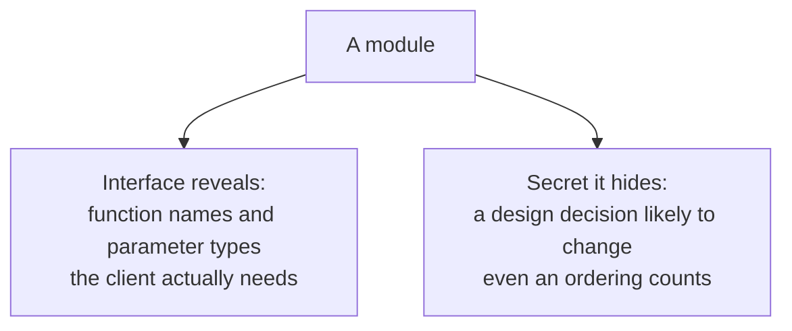

# 5. What a secret is, and is not

## The problem: "secret" is the word that gets flattened

The criterion is stated: hide a design decision likely to change. Fifty years of retelling have worn that down to "make your fields private," which keeps the word and loses the idea. So it is worth pinning down exactly what Parnas means by a secret, using his own paper, because he is more precise and more demanding than the folklore.

## Reveal as little as possible: the design error he confesses

The sharpest lesson is one Parnas turns on his own design. Look again at Circular Shifter in Modularization 2. It hid how the shifts were stored, which was good. But its interface specified an order for the shifts, and Parnas decides, in hindsight, that this was a mistake. Programs could have been written knowing only three things: that the lines in a shift's definition all exist in the table, that none is included twice, and that some function can recover the original line from a shift. By fixing an order on top of that, he says, "we have given more information than necessary and so unnecessarily restricted the class of systems that we can build." It rules out, for instance, a version where the shifts are produced already in alphabetical order, `ALPH` does nothing, and `ITH` just returns its argument. His verdict on revealing the order: "our failure to do this ... must clearly be classified as a design error."

Sit with that, because it redraws the target. The secret was not only the data layout. It was a behavioral commitment, an ordering, and committing to it leaked information a future version would want back. "Reveal as little as possible" is not a slogan here. It is aggressive enough that even specifying the order things come out in counts as revealing too much.

## A secret is a decision, not a variable

Parnas then lists specific decompositions he considers advisable, and the list makes clear how broad a secret can be:

1. A data structure, its internal linkings, and its accessing and modifying procedures belong in a single module, not shared across many.
2. The instruction sequence needed to call a routine, and the routine itself, belong together, because calling conventions on real machines keep changing.
3. Control-block formats hide inside a control-block module, rather than becoming the interfaces between modules.
4. Character codes and alphabetic orderings hide in a module.
5. The sequence in which items get processed hides in a single module.

Some of these secrets are data (a control-block format, a character code). Others are not data at all: a calling convention is a machine-level policy, and a processing sequence is a decision about time. What unifies them is not that they are private state. It is that each is a decision likely to change or to vary across versions, and each is walled off so its change cannot escape. That is the definition, and it is wider than any notion of a private field.

The first item is worth a note, because it is the one that looks most modern. A data structure bundled with the procedures that read and write it is very nearly the abstract data type. Barbara Liskov was arriving at that idea in the same years, from the programming-languages side, and it became CLU and the literature of data abstraction. Read them together and you see one insight surfacing in two communities at once. But the framings differ, and the difference is the lesson of this chapter: Liskov's unit is a type, Parnas's unit is a decision to hide. Two communities, one insight, neither borrowing from the other.

## What information hiding is not

Three flattenings are worth naming and refusing.

It is not "make your fields private." A private field is one later mechanism for keeping a secret, not the secret itself. A class can make every field private, then hand out a getter and a setter for each one, and it has hidden nothing: the representation is fully exposed through the accessors, and any client can come to depend on it. That is Modularization 1 wearing an object's clothes. Conversely you can hide a decision with no classes at all, in a Fortran subroutine, a file, or a service, which is what Parnas did, with none of the machinery we now call object orientation.

It is not object orientation. This paper is from 1972. Simula had introduced classes and objects five years earlier, but Parnas does not reach for them: he frames a module as a responsibility that owns a decision, not as a type with methods, and there is no inheritance, no access modifier, nothing like the later SOLID principles. Those are mechanisms and doctrines that grew up around information hiding afterward, and projecting them back onto the paper reads a later vocabulary into a work that predates it.

And it is not generic separation of concerns. Separation of concerns says keep unrelated things apart, which is good hygiene but says nothing about where to cut. Information hiding says something stronger and more specific: put the decision most likely to change behind a wall, so that when it changes the change cannot get out. The criterion is anticipated change, not tidiness, and that specificity is the whole contribution.

> **Principle:** A secret is a design decision you expect to change, hidden as tightly as the interface allows, not a variable you marked private. If a client can come to depend on the decision, you have not hidden it, whatever the access modifier says.
