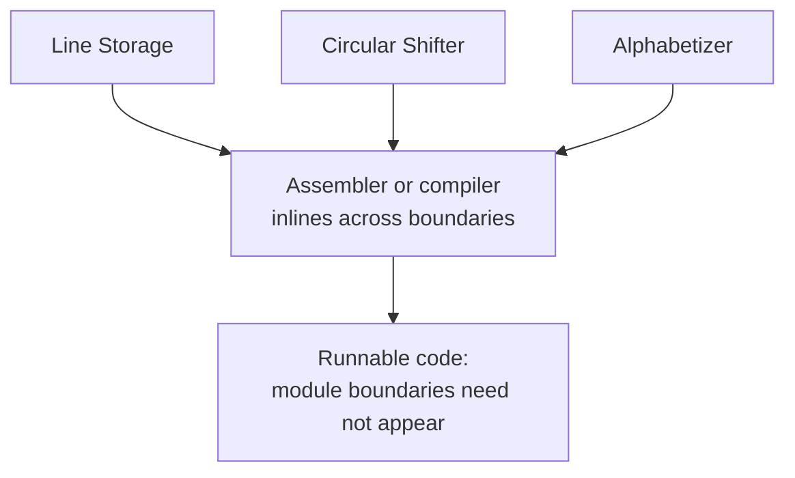

# 6. A module is not a subroutine

## The problem: hiding looks expensive

Parnas does not pretend information hiding is free, and the honesty is part of why the paper aged well. He states the cost outright: "if we are not careful the second decomposition will prove to be much less efficient than the first." The reason is mechanical. If every hidden function is a real procedure with a real calling sequence, then a system that reaches through `CHAR` and `CSCHAR` and `ITH` for every character does an enormous amount of calling, "due to the repeated switching between modules." Modularization 1 does not have this problem, because control passes between its big steps rarely. Cut by secret and you multiply the boundaries; cross a boundary with a procedure call and you pay at every crossing.

This is the objection that has been used against small modules, deep abstraction, and later against microservices, ever since. Parnas raises it himself, in 1972, and then answers it.

## The move: stop assuming a module is a subroutine

His answer is to break the assumption that quietly links the two. "To save the procedure call overhead, yet gain the advantages that we have seen above, we must implement these modules in an unusual way." The functions can be inserted directly into the calling code by an assembler, or compiled to specialized transfers, so that the module is a unit of source and responsibility even when it is not a unit of run-time control. What he asks for is "a tool by means of which programs may be written as if the functions were subroutines, but assembled by whatever implementation is appropriate," and he warns that if you do this, "the separation between modules may not be clear in the final code." He even proposes keeping several representations of the program at once, with a mapping between them.

The conclusion states it as a principle: "to achieve an efficient implementation we must abandon the assumption that a module is one or more subroutines, and instead allow subroutines and programs to be assembled collections of code from various modules." The module is where a decision lives. The subroutine is where the machine jumps. Parnas is telling you to keep those two ideas apart, and to let a tool collapse the first into the second.

This is the deepest restatement of the point from chapter 3, that the two decompositions can be identical after assembly. The decomposition organizes the source and the distribution of knowledge. The compiler decides the run-time shape. Once you separate them, the efficiency objection dissolves: you can have small, secret-keeping modules in the source and tight code in the binary.

## The modern echo, which is literally his proposal

The tool Parnas asked for is now standard, and it is a large part of why abstraction can be cheap. Compiler inlining takes a call to a small function and pastes the body into the caller, erasing the boundary. Link-time optimization does it across separate compilation units, so that module boundaries genuinely "are not clear in the final code," in his exact words. The phrase the industry uses, a zero-cost abstraction in C++ or Rust, names his 1972 bargain precisely: write as if the functions were subroutines, and let the compiler assemble them away so the abstraction costs nothing at run time. The objection that hiding is slow was answered by making the module a compile-time construct, which is what he told us to do.

## Hierarchy is a separate property, and it is worth not confusing

The chapter has one more warning, because a second idea tends to get fused to information hiding and should not be. Parnas notes that Modularization 2 also has a hierarchy, in Dijkstra's sense from the THE system. The symbol table sits at the bottom, line storage above it, the shifter and input above that, and so on, ordered by a "uses" or "depends upon" relation that forms a partial order. The hierarchy brings its own benefits: upper levels are simpler because they use the services below, and you can "prune" the tree, cut off the upper levels and keep a usable subsystem. The symbol table can be reused elsewhere; the line holder could anchor a different application entirely.

But then the crucial disclaimer: "hierarchical structure and 'clean' decomposition are two desirable but independent properties of a system structure." You can build a strict hierarchy whose modules still expose their formats to each other, a layered system with Modularization-1 interfaces, and get the ordering without the hiding. Layering is about who is allowed to call whom. Information hiding is about who is allowed to know what. They often appear together, and they are not the same thing, and a modern architecture diagram full of neat layers can still leak every decision across them.

Parnas closes the technical argument with a hint of what comes next. He mentions that an earlier information-hiding decomposition of a language translator turned out to be valid for a pure compiler and for several interpreters at once, where a classical split into syntax recognizer, code generator, and run-time routines would not have been. Hide the decisions and the same modules serve a whole family of related programs. He would develop that into a theory of program families four years later, in 1976. Here it is only a foreshadowing, and it is worth labeling as such rather than reading the later theory into the 1972 paper.

> **Principle:** A module is where a decision is kept, not where the processor jumps. Separate the two, let a tool assemble the boundaries away, and the cost of hiding falls to nothing at run time while the knowledge stays contained in the source.
