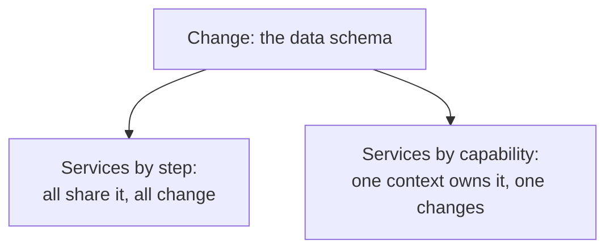

# 7. Modern echoes

Parnas wrote about a week-long program on a machine with a few thousand instructions. The argument scaled with the industry, because the question it answers, where do I draw the boundary, never went away. It just moved up, from procedures to modules to services to teams. Here are the places it lives now, kept structural rather than decorative.

## Microservices are the KWIC argument at cloud scale

The loudest modern version of Parnas's experiment is the debate over how to split a system into services. One school splits by technical layer or processing step: an ingestion service, a transformation service, an enrichment service, a delivery service, each a stage in the pipeline, all sharing the data schema that flows between them. That is Modularization 1 with the modules deployed on separate machines. And it fails the same way. Change the schema and every service has to change, because every service reads it, exactly as changing the core format touched every module in the flowchart KWIC. Worse, the teams that own those services cannot move independently, because they must jointly agree on the shared schema before anyone can ship, which is Parnas's "joint effort among the several development groups" reappearing as a cross-team coordination meeting.

The other school splits by capability. Domain-Driven Design, which Eric Evans set out in 2003, calls the unit a bounded context: a service owns a piece of the domain and hides its model behind an interface, so its internal data shape is a secret. "Own a capability, not a step" is Parnas's criterion in a slogan. When the model inside a bounded context changes, the change stops at the context boundary, the way the storage change stopped at Line Storage.

The analogy is exact on the decomposition criterion and breaks on the failure model, which is where the modern version is harder. Parnas's modules were in one address space, so a boundary was a function call. A service boundary is a network hop, with latency, partial failure, and no shared memory, none of which the 1972 paper had to reason about. The criterion for where to cut is the same. The consequences of cutting in the wrong place are more expensive, because a chatty boundary that would have been slow in Parnas's world is a distributed-systems problem in ours.

## Ports and adapters name the secret

Parnas's Line Storage, the module that hides how the lines are stored, is now a named architectural pattern. Hexagonal architecture, which Alistair Cockburn described around 2005 as ports and adapters, puts the application's core behind ports, which are interfaces of function names and types, and pushes every decision about the outside world, which database, which message broker, which wire format, into adapters behind those ports. The port is Modularization 2's abstract interface; the adapter is the secret. The Repository pattern is the same move aimed squarely at Parnas's own example: it hides whether your data is in Postgres, in a file, or in memory behind a handful of methods, so the storage decision can change without the callers knowing. That is Line Storage, fifty years on, with a pattern name.

Plugin architectures generalize the shape. A host defines an interface that reveals only what it needs from an extension, and each plugin hides its own implementation decision behind that interface. An editor's extension API, a browser's, an operating system's uniform driver interface: in every case the host is protected from the plugin's secrets, and the plugin from the host's, and either side can change behind the contract. It is information hiding used as the boundary between organizations, not just between modules.

## Conway's law is the managerial benefit, stated as a warning

Parnas's first promised benefit was managerial: cut well and separate groups can work with little need to communicate. Melvin Conway had published the mirror image of that observation in 1968, that a system's structure ends up matching the communication structure of the organization that built it. Put the two together and you get the rule that governs modern platform teams. If you decompose by processing step, the teams that own the steps are coupled through the shared data format and must coordinate constantly, so Conway's law predicts a tangled system built by a tangled org. If you decompose by secret, each team owns a decision and its interface, and can move alone. The modern practice of the inverse Conway maneuver, arranging teams deliberately so the architecture you want falls out of the org chart, is Parnas's managerial benefit turned into a staffing strategy. The cut is not only a technical choice. It decides who has to talk to whom.

## The programming-languages cousin

One echo runs sideways rather than forward. While Parnas argued for hiding decisions from the module side, Barbara Liskov was building the same instinct into a language. Her work on data abstraction and the language CLU, from the mid-1970s, made the abstract data type a first-class construct: a type whose representation is hidden and reachable only through its operations. Parnas's first advisable decomposition, a data structure bundled with the procedures that touch it, is nearly that idea. The two are convergent, developed in parallel in different communities, and it is a mistake to draw a line of descent either way. What matters is that hiding the representation showed up as good practice in software engineering and as a language feature in programming languages at almost the same time, which is usually a sign that the underlying idea is real.

> **Principle:** The boundary question outlived the scale it was asked at. Whether the pieces are procedures, modules, services, or teams, cutting along the decisions that change confines the blast radius, and cutting along the steps of the work spreads it. The cost of the wrong cut only grows as the pieces get further apart.
