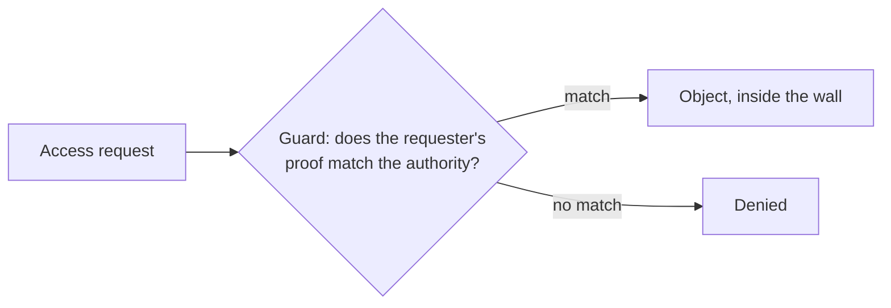

# 1. Why sharing needs a guard

## The problem: multiple use

The paper starts from a fact of its era that has only grown truer: computers are shared. Once several people use one machine, and they do not all have identical authority, the system needs some way to enforce the authority structure the owner intended. Saltzer and Schroeder open with an airline example. A reservation agent may make and cancel reservations. A boarding agent may additionally print the full passenger list. The airline may want to withhold that printout from the reservation agent, so that a request for a passenger list from a law enforcement agency is routed through the right level of management. Same system, same data, different authority for different people.

The hard part is named early and never goes away. The intruder is not always an outsider. "The biggest complication in a general-purpose remote-accessed computer system is that the 'intruder' in these definitions may be an otherwise legitimate user of the computer system." You are not only building a wall against strangers. You are drawing lines between people who are all, in some sense, already inside.

## Getting the words right

Before any mechanism, the paper fixes a vocabulary, because the terms were used loosely then and still are. Privacy is a social idea: the ability of a person or organization to decide when and to whom information is released. Security is the set of techniques that control who may use or modify the computer or its information. Protection is a narrower term for the security techniques that control the access of executing programs to stored information. Authentication is verifying that a requester is who they claim to be. This paper concentrates on protection and authentication, and it is unusually honest about the cost of that focus: "concentration on protection and authentication mechanisms provides a narrow view of information security, and that a narrow view is dangerous."

The danger has a precise shape. "The objective of a secure system is to prevent all unauthorized use of information, a negative kind of requirement." You cannot demonstrate a negative by testing. To be sure no unauthorized access is possible, you must show that every possible path has been closed, and no sample of successful denials proves the absence of a hole. That single observation drives half the paper: it is why the design must be small enough to inspect, why every access must be checked, and why the authors keep returning to the problem of certifying that a system does what it claims.

The paper also sorts the ways protection fails, following Anderson, into three categories: unauthorized release of information, unauthorized modification of information, and unauthorized denial of use. These three prefigure what a later generation would call confidentiality, integrity, and availability, but the paper does not use that framing, and it is worth keeping the lineages separate rather than stamping a later acronym on a 1975 list.

## The move: a wall, a door, and a guard

Out of all this the authors distill one picture that carries the whole tutorial. To protect an object, "build an impenetrable wall around each distinct object that warrants separate protection, construct a door in the wall through which access can be obtained, and post a guard at the door to control its use." The guard works by demanding "a match between something he knows and something the prospective user possesses." Authentication is the same picture pointed at a person instead of a program.

Everything technical in the paper is an elaboration of this. The wall is base-and-bound hardware or a segment boundary. The guard is a descriptor check, an access control list lookup, or a capability comparison. The thing the guard knows is a list or an expected ticket, and the thing the user possesses is an identity or a ticket. The reason this model matters is that it names the two things that must themselves be protected, beyond the object: the guard's authority information, and the binding between a user and their identity. A protection system, the authors note, usually ends up protecting its own implementation, and they will return to that idea until it becomes the trusted core of the system.

This is also the germ of what security would later call the reference monitor: a single check that every access must pass through, that cannot be bypassed, and that is simple enough to get right. The paper does not use that name, but the guard at the door is the idea, and the next chapters build it out.

> **Principle:** The unit that needs protecting is the shared object, and the only thing that protects it is a guard every access must pass through. Because the requirement is negative, to allow nothing unauthorized, the guard is only as trustworthy as your ability to show it has no way around it.
