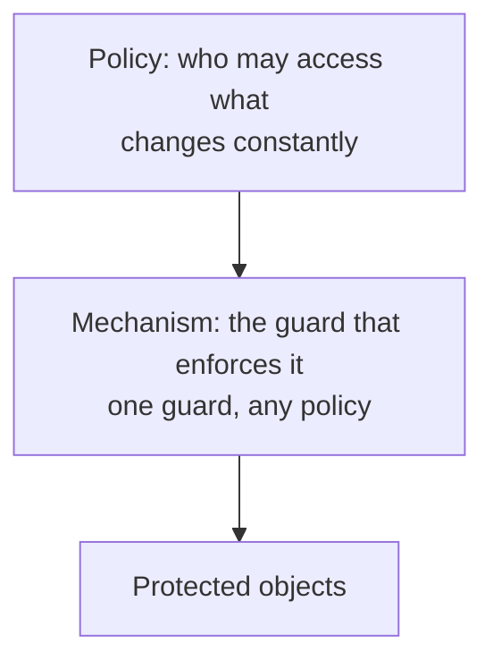

# 2. Mechanism, not policy

## The distinction that organizes everything

The single most useful idea in the paper is not on the list of eight. It is a distinction the authors hold to throughout: the difference between a protection mechanism and a security policy. The policy is the authority structure you want to enforce, who may read the salary file, who may cancel a reservation, which compartments a document belongs to. The mechanism is the machinery that enforces whatever policy you hand it: the guard, the wall, the descriptor, the access control list, the capability. A policy is a statement of intent. A mechanism is a way to make the intent stick.

The reason to separate them is that they change on completely different clocks. Policy changes constantly, as people join and leave, as files are created, as an owner decides to share one more thing. The mechanism should not have to change at all when the policy does. So the goal is a mechanism general enough to express the policies you have and the ones you have not written yet, without being rebuilt.

## How far up the mechanism must reach

Before comparing mechanisms, the authors measure how ambitious a policy a mechanism can even express, and they lay out a ladder of functional levels. At the bottom are unprotected systems, which stop nothing; in 1975 many commercial batch systems were here. Above that, all-or-nothing systems isolate users but share a public library, which is most of the first generation of time-sharing. Then controlled sharing, where each object carries a list of who may read, write, or execute it, which only a handful of systems had fully built. Then user-programmed sharing controls, where a user can define arbitrary rules by wrapping data in a program that mediates access. At the top, putting strings on information, keeping control even after data is released, which the authors admit almost no system did well.

Cutting across every level is what they call the dynamics of use: not just who may access what right now, but who may change that, and who may change who may change it. They point out that the hardest questions in protection are about this dynamic layer, and that most real systems differ less in their static policy than in how they handle change. A mechanism that can express a policy on paper but cannot safely revoke it at runtime has solved the easy half.

## Discretionary and nondiscretionary policy

The sharpest cut in the policy space, and the one that most shaped later security, is between discretionary and nondiscretionary controls. Under discretionary control, the individual who creates an object decides who else may use it. That is the default assumption behind most of the paper's examples: you make a file, you get all rights to it, and you hand out access as you see fit.

But discretionary control is not always acceptable. A manager developing a new product may need to compartmentalize the whole department's work so that only people with a need to know can reach it, and may not be willing to let any single employee widen that boundary by editing an access list. Military security goes further, with nested sensitivity levels, top secret, secret, confidential, that the system itself must enforce regardless of any individual's wishes. These are nondiscretionary controls, imposed from above and not adjustable by the users they bind. The authors note that the real driver here is not fear of malicious insiders so much as the need to safely run borrowed programs you have not audited, which is the thread that leads to confinement later in this seminar.

The point for this chapter is what the two have in common. The same mechanism, an access control list, a capability, a descriptor, can implement discretionary policy, nondiscretionary policy, or both at once, running in parallel and agreeing before access is allowed. Policy is what you want. Mechanism is how you get it. Keep them separate and you can change either without rebuilding the other.

## The modern echo

The crisp slogan for this, separating policy from mechanism, was coined the same year by the Hydra operating system project, which Saltzer and Schroeder cite; in their paper it is less a slogan than the quiet architecture of the whole tutorial. Either way, the split is now a design pattern with its own vocabulary. Access-control systems separate a policy decision point, which answers "may this subject do this?", from a policy enforcement point, which actually blocks or allows the call. A policy engine like Open Policy Agent evaluates rules written as data, while the enforcement mechanism that calls it stays fixed. SELinux separates the policy, a loadable set of rules, from the enforcement hook wired into the kernel. AWS IAM is a fixed evaluation mechanism over policies that are just JSON documents you rewrite daily. In every case the lesson is Saltzer and Schroeder's: build the enforcement once, to be simple and trustworthy, and let the policy be data that changes above it. The eight principles that follow are almost all about the mechanism, about how to build a guard you can trust, precisely because the policy is expected to be someone else's ever-changing problem.

> **Principle:** Separate the mechanism that enforces access from the policy that decides it. Build the mechanism to be simple and trustworthy and to serve policies not yet written, and let the policy live above it as something that can change without touching the guard.
