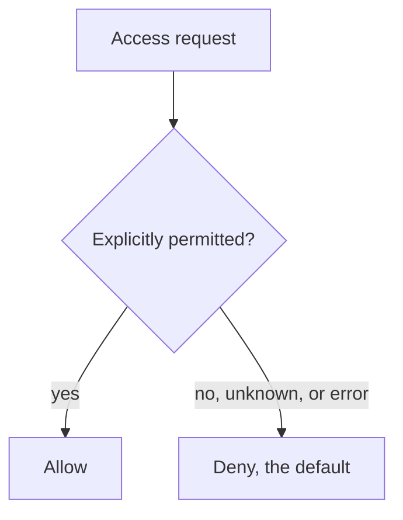

# 3. Building the guard: four principles

The eight principles are usually printed as a flat list, which hides that they answer two different questions. Four of them are about how to build the guard itself, so that you can trust it. The other four, in the next chapter, are about how much authority to hand out once the guard works. This chapter takes the first four, and the thread through them is simple: a guard you can trust is small, defaults to no, checks everything, and keeps no secrets in its design.

## Economy of mechanism: small enough to inspect

"Keep the design as simple and small as possible." This sounds like generic good advice, and the authors know it, so they give the reason it bites harder for protection than anywhere else. A functional bug shows up in normal use, because normal use exercises the function. A protection bug does not, because normal use does not include attempts to sneak through improper access paths. Nobody trips over the unlocked back door during the day. So you cannot test your way to confidence; you have to inspect, line by line for software and gate by gate for hardware, and inspection is only possible if the thing is small.

This is Lampson's "keep it simple" pointed at the guard, and the authors make the connection themselves. When they describe a supervisor that protects itself with the same isolation hardware that separates users, they call it "an example of the economy of mechanism design principle." The less machinery you have to trust, the more of it you can actually check. Fifty years later this reappears as the goal of shrinking the trusted computing base, the part of the system whose failure would breach security, down to something a person or a proof can get all the way through.

## Fail-safe defaults: base decisions on permission, not exclusion

"Base access decisions on permission rather than exclusion." The default is no access, and the mechanism names the specific conditions under which access is granted. The authors credit the idea to E. Glaser in 1965, and the argument for it is about how mistakes fail. A mechanism built to grant permission, when it has a bug, tends to fail by refusing access, which is safe and gets reported immediately because someone's legitimate work broke. A mechanism built to exclude, when it has a bug, tends to fail by allowing access, and that failure is silent, because nobody notices a door that should have been locked but was not.

One caution, because the words invite it: this is not "fail-safe" in the reliability sense of keeping working through a fault. It is default-deny, an allowlist. The safety is that the safe state is the closed one, so a bug, an unhandled case, or a half-finished configuration all land on "no." A large system will always have some object nobody thought carefully about, and you want that object locked, not open.

## Complete mediation: check every access, every time

"Every access to every object must be checked for authority." The authors call this "the primary underpinning of the protection system," and its force is in the words every and every. It demands a system-wide view that includes the paths people forget: not just normal operation but initialization, recovery, shutdown, and maintenance, the modes where checks are most often skipped and most often exploited. It demands a foolproof way to identify the source of every request.

And it contains a warning aimed straight at the instinct of every performance-minded engineer: "proposals to gain performance by remembering the result of an authority check [should] be examined skeptically. If a change in authority occurs, such remembered results must be systematically updated." Caching an authorization is caching a decision that can go stale. The authors are honest that this is aspirational, and the honesty is instructive. Later in the same paper, when they need to make access control lists fast, they add shadow registers that cache a decision, and they immediately note that changing the list no longer revokes the cached copy until it is cleared. Complete mediation is the ideal; every real system trades a little of it for speed and inherits a revocation gap in return.

## Open design: no secrecy in the mechanism

"The design should not be secret." The mechanism must not rely on attackers not understanding it; it should rely only on the secrecy of keys or passwords, which are small, replaceable, and easy to protect. This is the systems statement of a principle Auguste Kerckhoffs published for military cryptography in 1883: the security must survive the enemy knowing everything about the system except the key.

Two misreadings are worth heading off. Open design is not open source. It predates open-source software by about a century, and it is a claim about what your security may depend on, not a claim about publishing code under a license. You can keep your source proprietary and still honor open design, as long as you assume an attacker who knows how the mechanism works. And the argument is practical, not idealistic: the authors point out that a widely distributed system cannot keep its design secret anyway, so a design that needs secrecy to be safe is already broken. Decoupling the mechanism from the keys is also what lets the mechanism be reviewed by many eyes, which is how you gain confidence in a negative requirement you cannot test.

## The warning label

The authors attach a caveat to the whole list that most retellings drop: "these principles do not represent absolute rules, they serve best as warnings. If some part of a design violates a principle, the violation is a symptom of potential trouble." They are diagnostic, not doctrine. A design that caches an authorization or keeps part of its mechanism secret is not automatically wrong; it is a place to look hard and justify the exception. That framing is the difference between engineering judgment and a compliance checklist, and it is why these four have survived being quoted for half a century.

The modern shapes are direct: economy of mechanism is the drive to minimize the trusted computing base, fail-safe defaults is the default-deny firewall rule, complete mediation is the reference monitor and its network-scale descendant zero trust, and open design is the reason we trust public algorithms like AES and keep only the keys secret. The next chapter maps them in detail. First, the other four principles, about what to do once the guard works.

> **Principle:** A guard you can trust is small enough to inspect, closed by default so its mistakes fail shut, positioned so every access must pass through it, and open enough in design that its safety rests on the keys, not on the attacker's ignorance.
