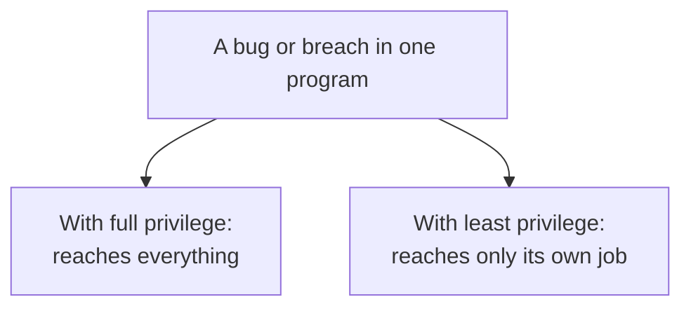

# 4. Granting authority: four principles

The first four principles build a guard you can trust. The next four assume the guard works and ask a different question: how much authority should flow through it, to whom, and can the people involved actually use it? The thread here is: grant the least, require more than one key for the dangerous things, share as little mechanism as possible, and make the whole thing usable.

## Least privilege: only what the job needs

"Every program and every user of the system should operate using the least set of privileges necessary to complete the job." This is one of the most successful of the eight, one that made it into everyday practice under its own name. The argument is about blast radius. A program that holds only the privileges its task requires can, when it fails or is subverted, damage only what its task could reach. A program running with everything can lose everything.

The authors add a second benefit that is easy to overlook: least privilege reduces the number of interactions among privileged programs, so there are fewer chances for one privileged component to be tricked into misusing its power on behalf of another, and fewer programs to audit when something goes wrong. Their metaphor has entered the language. "If a mechanism can provide 'firewalls,' the principle of least privilege provides a rationale for where to install the firewalls." The military rule of need-to-know is the same idea: hold only the clearance the task demands.

## Separation of privilege: two keys

"A protection mechanism that requires two keys to unlock it is more robust and flexible than one that allows access to the presenter of only a single key." The authors credit R. Needham in 1973, and their examples are physical: the bank safe-deposit box that needs the customer's key and the bank's, the nuclear weapon that fires only when two people both give the command. The value is that once the mechanism needs two keys, you can put the two keys in different hands, so that "no single accident, deception, or breach of trust is sufficient to compromise the protected information." Generalized, it is any situation where two or more conditions must all be met before access is granted.

This principle is the victim of one of security's most persistent name collisions, so it is worth stating plainly. Separation of privilege, here, means requiring two keys. It is not the same thing as privilege separation, the technique Niels Provos and colleagues introduced in 2003 and built into OpenSSH, which splits a program into a small privileged monitor and larger unprivileged worker processes. That later technique is really an application of least privilege, the previous principle, not this one, and its own authors describe it as orthogonal to the capability and confinement mechanisms. Same three words in a different order, a different idea, and nearly three decades apart. The modern descendant of separation of privilege is multi-factor authentication: something you know and something you have, two keys, so that a stolen password alone is not enough.

## Least common mechanism: share as little as possible

"Minimize the amount of mechanism common to more than one user and depended on by all users." This is the most forgotten of the eight, and the one whose importance has grown the most, so it deserves care. The authors give two reasons to distrust shared mechanism. First, and this is the deep one, "every shared mechanism (especially one involving shared variables) represents a potential information path between users," a channel by which one user can learn about or signal to another, whether or not anyone intended it. Second, a mechanism that serves everyone must be certified to everyone's satisfaction, which is harder than satisfying one user.

Their concrete advice: given the choice between adding a new function as a supervisor procedure shared by all users, or as a library procedure each user gets a private copy of, choose the library. Then a user who distrusts the function can replace it or decline it, and a flaw in it cannot reach across all users at once. The idea that a shared resource is a covert path is the 1975 seed of side-channel and covert-channel attacks, and it grew into some of the most consequential vulnerabilities of the modern era. The next chapter but one follows that growth all the way to shared CPU caches; for now, note that this principle is the reason isolation is worth paying for even when sharing would be cheaper.

## Psychological acceptability: security people will actually use

"It is essential that the human interface be designed for ease of use, so that users routinely and automatically apply the protection mechanisms correctly." This is the principle that remembers there is a person in the loop. The authors add the mechanism behind it: "to the extent that the user's mental image of his protection goals matches the mechanisms he must use, mistakes will be minimized. If he must translate his image of his protection needs into a radically different specification language, he will make errors."

That is a remarkable thing to have written in 1975, because it treats usability as a security property, not a nicety. A protection scheme that people find confusing is not merely annoying; it is insecure, because confused people set it wrong, and a wrongly set control protects nothing. The whole field of usable security is a footnote to this sentence, from the discovery that ordinary users could not operate email encryption to the current migration away from passwords, which people demonstrably cannot manage, toward mechanisms that ask less of them.

## The four, together

Read as a set, these four are a theory of how to hand out power. Give the least of it that works, so a failure is contained. Require two keys for the actions where a single failure would be catastrophic. Share as little mechanism as you can, because everything shared is a channel. And shape all of it to fit the mind of the person who has to operate it, because a control they cannot understand is a control they will misconfigure. The next chapter turns from the principles to the two great mechanisms the paper compares, the capability and the access control list, and shows how the choice between them decides which of these principles come easily and which come hard.

> **Principle:** Hand out the least authority that does the job, demand a second key for the irreversible actions, share as little mechanism as possible because every shared thing is a channel, and fit the controls to the human, because security a person cannot use is not security.
