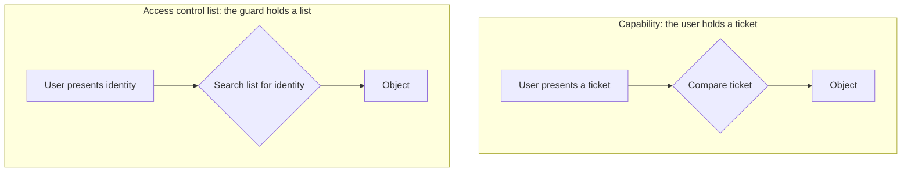

# 5. Capabilities and access control lists

## Two ways to build the guard

With the principles in hand, the paper turns to the mechanism, and it finds that essentially every protection system is one of two shapes, a distinction the authors take from Wilkes. Either the guard holds the list, or the user holds the ticket.

A list-oriented mechanism is an access control list. The guard keeps, for each object, a list of the principals allowed to touch it and what they may do. When you request access, you present your identity, and the guard searches the list for your name. A store clerk checking a credit-customer list is the everyday version; your driver's license is the identity you present.

A ticket-oriented mechanism is a capability. Here the guard holds only a description of what it expects, and each user carries a collection of unforgeable tickets, one for each object they may reach. A capability, in the paper's glossary, is "an unforgeable ticket, which when presented can be taken as incontestable proof that the presenter is authorized." A locked door and its key is the everyday version: the lock does not keep a list of who may enter, it just honors the key. Capabilities came from Dennis and Van Horn in 1966, and one way to make tickets unforgeable is a tagged architecture, where a bit on each memory word marks it as a capability that ordinary instructions cannot fabricate.

## The mechanical difference, and what follows from it

The difference looks small and decides almost everything. A capability check is a comparison: the guard sees a valid ticket and allows the access, and the user has already done the work of choosing which ticket to present as part of deciding what to touch. An access control list check is a search: the guard must look up the presenting principal in a list at the moment of access. Comparison is fast; associative search is slower and costlier. So capabilities tend to sit where traffic is heavy, and access control lists where control matters more than speed.

The consequences ripple out into the properties that actually matter in operation, and here the two mechanisms trade places.

| Dimension | Capability | ACL |
|---|---|---|
| Check | compare ticket | search a list |
| Speed | fast | slower |
| Revocation | hard | immediate |
| Audit | hard | read the list |

The capability system's virtues are efficiency, simplicity, and flexibility; a capability behaves like a pointer, so it fits naturally into how programs already pass references around. But those same virtues create three problems the authors lay out carefully. Revocation is hard: once you have handed someone a capability, they have stored a copy somewhere you cannot find, and short of destroying the object there is no clean way to take it back. Propagation is uncontrolled: the holder can copy the ticket and pass it to a third party without the owner's knowledge or consent. And review is hard: to answer "who can reach this object?" you would have to search every segment in the system for copies of the ticket, and then trace every path to those copies. The authors survey the patches, a copy bit that forbids duplication, a depth counter that limits how far a capability can propagate, designated capability-holding segments, and Redell's proposal to route a capability through an indirect object you can later destroy. That last one yields their crisp conclusion: revocation requires indirection.

The access control list system is the mirror image. Because the guard consults the list on every access at the last possible moment, revocation is immediate, remove the name and the next access fails, and the question "who may access this?" is answered by reading the list. What it pays for that is speed and simplicity: the search is costlier, and lists that grow and shrink are awkward to store.

## Why real systems use both

The authors' practical conclusion is that a real system uses both, layered. Put an access control list at the human interface, where people reason about who may do what and where revocation and audit matter, and put a capability system underneath, where speed matters and the checks are frequent. The higher, list-oriented layer hands out temporary tickets that the lower, ticket-oriented layer honors. Multics, the system both authors worked on, did just this: access control lists interpreted in software, sitting over tables of hardware descriptors.

The paper even shows the seam, and it is honest about the cost. To keep an access control list system fast, you can give each pointer a hidden shadow register that caches the descriptor and permissions after the first lookup, so later accesses skip the list search. That is a capability quietly cached under an access control list, and it buys speed at the price of the exact property the list was for: change the list and the cached shadow is not revoked until it is cleared. This is complete mediation from chapter 3, breaking against performance in a real design, in the authors' own worked example. The combination is not a compromise they apologize for; it is the shape almost every system settles into.

Underneath both mechanisms sits the accounting that makes them mean anything. The principal is the entity accountable for what a running program does, the unit of blame. A domain is the set of objects a principal may reach. And the authors note a subtle limit on all of it: to authorize sharing dynamically, there must first be communication outside the system, because the sender has to learn the recipient's true principal identifier from some trustworthy channel before the machine can safely hand over access. The mechanism can enforce a policy, but the intent behind the policy always enters from outside.

## The modern echo

The split is still this, and naming it makes a lot of modern security legible. A capability is a bearer token: an OAuth access token, a signed URL, a session cookie, a Unix file descriptor passed between processes. Whoever holds it can use it, it is fast to check because you just validate the token, it can be copied and passed along, and it is notoriously hard to revoke before it expires, which is why bearer tokens are given short lifetimes and paired with revocation lists, the same indirection Redell proposed. An access control list is a filesystem ACL, an IAM policy, or a role-based system: a list the system consults on every request, slower but centrally revocable and auditable. The object-capability revival in systems like Capsicum and Fuchsia is a deliberate bet on the capability side for its least-privilege properties. And the layering the authors described is everywhere: a slow, auditable policy check issues a fast, short-lived token that the hot path honors, with all the revocation-lag that implies.

> **Principle:** A guard either holds a list and searches it, or honors a ticket and compares it. Lists give you revocation and audit at the cost of speed; tickets give you speed and flexibility at the cost of control. Real systems layer a list over tickets, and inherit a revocation gap at the seam.
