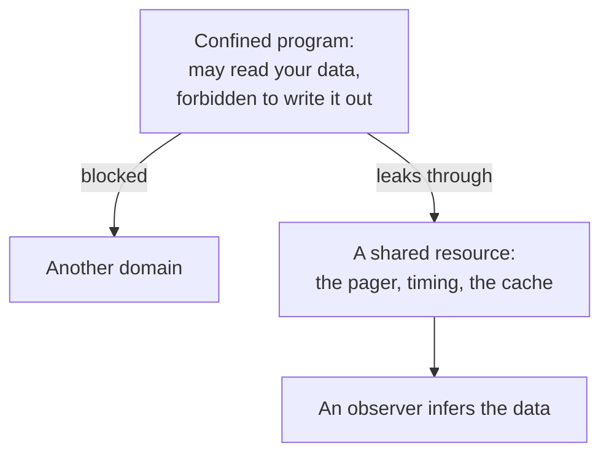

# 6. Confinement and the shared mechanism

## The problem: the borrowed program

There is a threat the access control list and the capability do not handle, and the paper is careful to isolate it. You want to run a program someone else wrote. A contract software house sends you an APL interpreter or a fast sort routine. To do its job it must be given access to your data. But you have not audited it, and once it can read your data, what stops it from keeping a copy, or mailing it out, or writing it somewhere its author can later collect? Refusing to run any code you did not write yourself is, as the authors note, "an unbearable economic burden" for most organizations. So the real question is how to let a program work on your data without letting it release your data.

This is the confinement problem, and the authors are scrupulous about whose it is: it is "a term introduced by Lampson," in his 1973 note on exactly this question. It is not their coinage, and the seminar keeps the attribution because the confinement problem becomes one of the deepest and least solved in the field.

## The move, and where it leaks

The direct answer is to run the borrowed program in a confined domain: give it the data it needs, but constrain it so it cannot pass anything it finds or creates to another domain. Discretionary controls are not enough here, because the whole point is to override what the program itself might choose to do, so confinement needs the nondiscretionary, compartment-style controls from the mechanism chapter. And it needs a specific and non-obvious restriction on writing. If a program may read data labeled for two compartments, "pricing policy" and "new product line," it must not be allowed to write into an object labeled with only one of them, because it could copy the joint data into the narrower compartment and breach the boundary. The authors point to the military-security formalizations of this: Weissman's high-water mark, which labels any written object with all the compartments the writer has seen, and the Bell and LaPadula model, which forbids the write-down outright. The rule that a confined process may write only where its full label is allowed is the counterintuitive heart of mandatory access control.

And then the paper admits the mechanism cannot fully win. "Complete confinement of a program in a shared system is very difficult, or perhaps impossible," because the program can signal to the outside "by strategies more subtle than writing into shared segments." It can vary its paging rate in a pattern an outside observer can read. It can simply stop, causing its user to go ask the author for help and thereby revealing that it stopped. D. Edwards gave this the memorable name "banging on the walls." The program obeys every rule about what it may write, and still gets information out, by modulating something it shares with the rest of the system.

## This is the least common mechanism, cashed in

Now the most forgotten principle pays off. Least common mechanism warned that "every shared mechanism represents a potential information path between users." Confinement is where that warning turns concrete. The confined program leaks not through the front door, which is bolted, but through a resource it shares with everyone else, whose observable behavior it can modulate and an observer can read. The shared pager is the channel. The shared processor is the channel. Anything two domains share is a place where one can whisper to the other. This kind of leak is what security would later call a covert channel when it is used deliberately, and a side channel when the information escapes through a shared resource without the sender even trying.

The lesson runs in one direction: the only airtight defense against a shared-resource channel is to stop sharing the resource, which is precisely least common mechanism. Everything short of that, from limiting how finely a program can observe the shared resource to adding noise, is mitigation, not cure. Confinement is a boundary you can raise high but never quite close, because as long as two computations share a machine, the machine itself is a channel between them.

## The modern echo

This is the 1975 ancestor of some of the most consequential vulnerabilities of the modern era. Spectre and Meltdown, disclosed in 2018, extract secrets across supposedly airtight boundaries by reading the timing of a shared CPU cache: a program that is forbidden to read another's memory directly infers it from how fast the shared cache responds. That is the confined program modulating a shared resource, and an observer reading it, exactly the risk the paper named, though naming the risk is not the same as foreseeing the specific attack, and the seminar claims only the lineage. The same shape recurs across the cloud: cross-tenant leakage on shared hardware, cache-timing attacks that recover cryptographic keys, and the noisy-neighbor problems of multi-tenancy are all least common mechanism collecting its debt. And the defenses are the principle applied: constant-time code that refuses to let secrets affect timing, cache partitioning, and, at the limit, dedicated hardware for the most sensitive work, because the surest way to close a channel through a shared resource is not to share it.

Confinement also points at the paper's other lasting structural idea. To run untrusted code safely you put it in its own domain, a protected subsystem, encapsulated so it can be invoked but cannot reach out. The supervisor is itself such a subsystem, protecting its own implementation with the same machinery it uses to protect users. The authors observe that no one had yet established "a minimum set of protected supervisor functions, a protected kernel" for a full-scale system. That unfinished goal is the trusted computing base, and the drive to make it small enough to verify is economy of mechanism aimed at the one component whose failure breaks everything.

> **Principle:** A boundary can be raised high but never fully closed while resources are shared, because a shared mechanism is a channel a confined program can whisper through. The only complete defense against a shared-resource leak is to stop sharing the resource.
