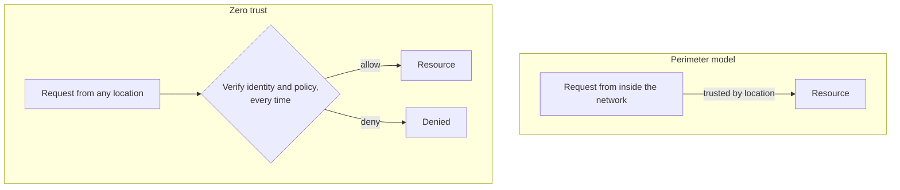

# 7. Modern echoes

The reason this paper still gets assigned is that its eight principles became the working vocabulary of security. An engineer writing an IAM policy or a firewall rule is speaking Saltzer and Schroeder whether or not they know the names. This chapter maps the principles onto the systems we run now and marks where the modern idea is a descendant rather than the same thing.

## The operational trio that thrived

Three principles turned into daily practice under their own names. Least privilege is the design goal of every serious authorization system: an AWS IAM policy that grants exactly the actions and resources a service needs and nothing more, a Linux process that drops all capabilities except the one it uses, a seccomp filter that allows only the handful of system calls a program actually makes, a daemon that binds its port as root and then drops to an unprivileged user. Each shrinks the blast radius of a compromise to what the task itself could reach, which is the firewall metaphor the paper coined.

Fail-safe defaults is the default-deny rule at every layer. A firewall or cloud security group that denies all traffic and permits only named flows. A Kubernetes cluster where, once you apply a default-deny NetworkPolicy, a pod can talk to nothing until you write the allowlist. The recurring advice to prefer allowlists over denylists is this principle restated: enumerate what is permitted, because you cannot enumerate everything that is forbidden.

Separation of privilege is multi-factor authentication. Two keys, something you know and something you have, so that a stolen password is not enough. It is also the two-person rule behind production deploys that require a second approver, and the split-key custody of the most sensitive secrets. The value is the paper's: put the two keys in different hands and no single theft or mistake is sufficient.

## Complete mediation grew into zero trust

Complete mediation, the demand that every access be checked, was formalized by James Anderson in 1972 as the reference monitor: a check that mediates every access, cannot be tampered with, and is small enough to verify. That definition became the spine of trusted-system design. Its network-scale descendant is zero trust, the "never trust, always verify" model that Google's BeyondCorp made concrete. Zero trust is chapter 1's guard with one exception removed: it refuses to trust a request because of where it came from. The old perimeter model trusted anything already inside the network; zero trust checks every request, from inside or outside, every time.

The paper's specific warning about complete mediation is now a named anti-pattern. Caching an authorization decision means the cache can go stale, so a token or session that is not re-checked after a permission change keeps working after it should have stopped, which is the revocation gap from the capability chapter in production form. The mitigations are all admissions that complete mediation is expensive: short token lifetimes, revocation lists, and forcing re-validation on sensitive actions. Saltzer and Schroeder told you to examine such caching skeptically, and every session-management bug proves them right.

## Open design is why public cryptography works

Open design is the principle a modern engineer states as "no security through obscurity." AES and RSA are fully public; anyone can read the algorithm, and the security rests entirely on the secrecy of the key, exactly as Kerckhoffs demanded in 1883 and the paper restated in 1975. This was not obvious at the time. The authors note, a little ruefully, that since World War II only a handful of significant cryptography papers had appeared in the open literature, because the field lived under military classification. Public-key cryptography broke that open within a few years of this paper, and the modern consensus, that a cipher is trustworthy precisely because it has been public and unbroken for years, is open design vindicated.

## Economy of mechanism became the small trusted core

Economy of mechanism aimed at protection was always about being small enough to inspect. Its logical endpoint is seL4, a microkernel with a machine-checked mathematical proof of functional correctness, made possible only because the kernel is small, around ten thousand lines. That is the principle taken as far as it can go: not "inspect it carefully" but "prove it correct," which you can attempt only when the trusted computing base is tiny. This is also where the security seminar closes the design arc. A small trusted core is Lampson's "keep it simple" applied to the guard, and a core that hides the security decision behind a clean boundary is a Parnas module whose secret is the protection mechanism itself. The book's recurring question, where should trust live, gets its security answer here: in the smallest, most completely checked, least privileged core you can build, and ideally one small enough to verify.

## The two the field keeps relearning

Two principles have aged into unfinished business. Psychological acceptability, the insistence that security must be usable or it will be misconfigured, was proven the hard way. "Why Johnny Can't Encrypt," a 1999 study, found that ordinary users simply could not operate email encryption correctly no matter how sound the cryptography was. The long migration from passwords, which people demonstrably cannot manage, toward passkeys and hardware authenticators is the field finally taking the principle seriously by asking less of the human. And least common mechanism, from the previous chapter, keeps returning as the side channel: Spectre and Meltdown are shared-resource leaks in silicon, and each new one is a reminder that the most forgotten principle named a permanent risk. A 2012 retrospective on these principles put it bluntly: some, like least privilege, thrived, while others, like economy of mechanism and complete mediation, largely failed to thrive in practice, defeated by performance and complexity. The principles are warnings, and the field has heeded some far better than others.

## Where this points

Every echo in this chapter lives on one machine or one administrative domain. The principles do not stop there. Complete mediation and least privilege, carried across a network of machines that do not trust each other, are what became zero trust. Open design, carried onto the wire, is why we run open protocols secured by public cryptography. The next seminars build the network those ideas have to cross: Cerf and Kahn design an architecture for interconnecting networks that do not trust one another, and Clark explains the philosophy that decided where the intelligence, and the trust, should sit. This paper answered where trust lives inside a computer. The network forces the question again, with no shared hardware to lean on.

> **Principle:** The eight principles became the vocabulary of modern security, but unevenly. Least privilege, default-deny, and two keys thrived; complete mediation and economy of mechanism keep losing to performance and complexity. Read the ones that struggled as the standing warnings they were meant to be.
