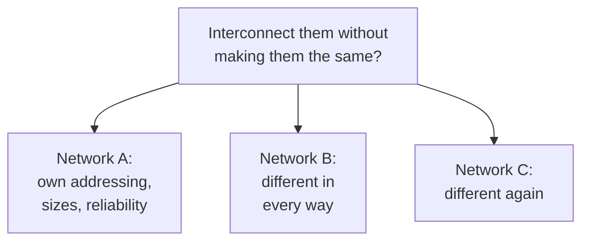

# 1. Networks that do not match

## The problem: a network of networks

By 1974 packet switching was no longer a theory. The ARPANET had run for four years and proved the idea, and other packet networks were arriving that were nothing like it: packet radio networks for mobile stations, satellite networks spanning oceans, each built by different people for different physics. Cerf and Kahn set aside the question everyone had been answering, how to build a good packet network, and asked the one nobody had: what do you do when you want two of them, built by different people under different assumptions, to talk to each other?

This is not the problem of making a bigger network. It is the problem of joining networks that were never designed to cooperate, that are owned by different organizations, and that their owners have no intention of rebuilding. The paper names the goal in its first lines: a protocol "that supports the sharing of resources that exist in different packet switching networks," where earlier protocols "addressed only the problem of communication on the same network." The word doing the work is different.

## The five ways they refuse to match

The paper is concrete about why this is hard, listing the ways two packet networks differ. Each is a mismatch that has to be bridged:

- Addressing. Each network names its hosts its own way, so you need a uniform scheme laid over all of them.
- Packet size. Each accepts a different maximum size, so data crossing a boundary may have to be broken into smaller pieces.
- Timing. Each has its own delays in accepting, delivering, and transporting data, so success and failure look different on each.
- Disruption. Within any network, data can be lost or mutated beyond recovery, so, in the paper's words, "end-to-end restoration procedures are desirable."
- Status and control. Routing, fault detection, and the way a network reports a dead destination differ from network to network.

None of these is exotic. Together they say that the networks agree on almost nothing, and any interconnection has to work anyway.

## Why the obvious fixes fail

Two answers present themselves, and the paper rejects both. The first is to make the networks the same: agree on one standard and rebuild everyone to it. That is a non-starter, because the networks are independently owned and already running, and forcing uniformity would freeze the whole enterprise at the pace of its slowest committee. The second is to translate at the boundary: have the interface between two networks convert one's host and process protocols into the other's. The paper rejects this too, for a reason that scales badly. If interconnection means translation, then in the limit "every HOST or process [must] implement every protocol (a potentially unbounded number) that may be needed to communicate with other networks." Every new network multiplies the translators. The combinatorial cost is fatal.

## The move, stated as a constraint

So Cerf and Kahn set a constraint that rules out both bad answers and points at the good one. The interconnection, they insist, "must preserve intact the internal operation of each individual network." Nobody rebuilds. And the way to achieve that is disarmingly simple: let two networks "interconnect as if each were a HOST to the other network." A network does not need to understand another network; it only needs to treat the thing on its edge as one more host sending it packets. From that follows the rest of the paper: a common protocol spoken by the hosts, and an interface between networks that "should take as small a role as possible." Keep the networks as they are, put a simple box between them, and push the hard work to the edges.

That is the shape of the whole design, and the next chapters build it: the box between networks in chapter 2, and the common program in the hosts in chapter 3.

> **Principle:** To connect systems that were never meant to cooperate, do not make them uniform and do not translate between them. Preserve each one intact, treat each neighbor as just another host, and put the work of bridging the differences somewhere that can change without anyone's permission.
