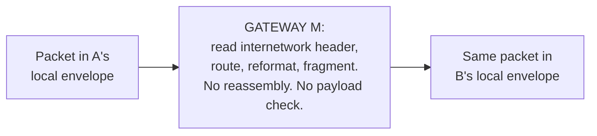

# 2. The gateway

## The problem: something has to sit between two networks

If networks stay as they are and hosts speak a common protocol, one question remains: what physically joins network A to network B? Cerf and Kahn give that thing a name. "We give a special name to this interface... and call it a GATEWAY." A gateway sits on the boundary between two networks and passes packets across it. In their Figure 2, three networks A, B, and C are joined by two gateways M and N, and a packet from a process in A bound for a process in C rides through A to gateway M, across B to gateway N, and into C. "The responsibility for properly routing data resides in the GATEWAY."

The whole design turns on how much this box is allowed to do. The temptation is to make it clever: let it translate protocols, smooth over every difference, guarantee delivery. Cerf and Kahn push hard the other way. They want the interface "as simple and reliable as possible," dealing "primarily with passing data between networks."

## What the gateway does, and the design trick that keeps it simple

A gateway does a short list of things. It routes, reading a destination network identifier to decide where the packet goes next. It reformats, wrapping the packet in whatever local envelope the next network requires. And it does per-network accounting, because networks under different ownership will want to bill for the traffic they carry.

The trick that keeps this simple is the internetwork header. The source host prefixes every packet with a standard header the gateway understands, carrying the source and destination addresses, a sequence number, a byte count, flags, and a checksum. Each network then wraps that packet in its own local header for its own purposes, and strips it at the far side. The gateway reads the standard header and never has to understand the networks' internal protocols. A gateway can even be built "of two halves, each associated with its own network," one half speaking to A and one to B, agreeing only on the standard internetwork format between them.

## Fragmentation, and the thing the gateway refuses to do

The clearest illustration of gateway minimalism is fragmentation. Networks accept different maximum packet sizes, so a packet that crossed A may be too big for B, and the gateway must split it into smaller pieces. Cerf and Kahn make two deliberate choices here. First, they refuse to specify a maximum packet size at all, because fixing one would couple every network's internal parameters together and freeze them against future technology. Each network keeps its own sizes; the gateway fragments as needed on entry to the next network, the only place that knows that network's limits.

Second, and this is the load-bearing decision, the gateway fragments but does not reassemble. Putting the pieces back together is left entirely to the destination host. The paper is explicit about why: gateway reassembly "can lead to serious buffering problems, potential deadlocks, the necessity for all fragments of a packet to pass through the same GATEWAY, and increased delay." Reassembling in a gateway would force it to hold state, wait for stragglers, and pin a flow to one path. So the gateway does the cheap, stateless half, splitting, and the host does the expensive half, reassembling. When a gateway splits a packet it adjusts the sequence number and byte count in the header, but it never touches the text and never recomputes the checksum. It moves bytes and gets out of the way.

Notice the pattern in what the gateway will not do. It does not translate host protocols. It does not verify the payload. It does not hold a connection. It does not reassemble. It does not guarantee delivery. Every one of those jobs is pushed off the boundary and onto the hosts, which is the architectural bet the next two chapters cash in.

## The modern echo

The gateway is the direct ancestor of the router, and the word matters: in 1974 it is a gateway, and this seminar keeps the period term. What survived is not the name but the discipline. The core of the internet forwards packets by reading a header and consulting a routing decision, and it works hard to avoid holding per-flow state, precisely so that any packet can take any path and no box in the middle becomes a bottleneck or a single point of failure. The refusal to reassemble in the middle aged especially well: modern practice moved away from in-network fragmentation entirely, a story chapter 7 picks up. And a gateway "of two halves" that agree only on a standard format is the shape of every network interconnection since, from a border router to a peering point, where two independently run networks meet and agree on the wire format and nothing else. The full grown-up version, autonomous systems exchanging routes through BGP, is chapter 7. The seed is here: a dumb box on the boundary that routes and reformats and otherwise stays out of the way.

> **Principle:** The box that joins two networks should do the least that lets a packet cross: route it, reformat it, and forward it untouched. Every job you can push off the boundary and onto the endpoints is a job that cannot wedge the middle or pin a flow to a path.
