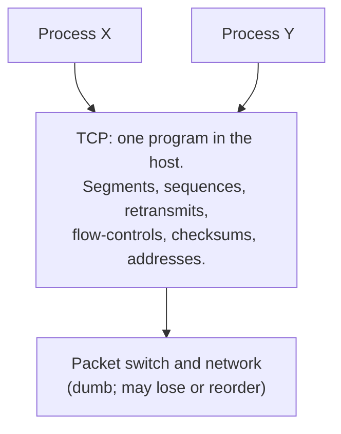

# 3. One program in the hosts

## The problem: if the network does nothing, the host must do everything

The gateway routes and reformats and refuses everything else. The networks lose, reorder, and corrupt packets and make no promises. So the reliability, the ordering, the flow control, the connections, all the work of turning a lossy packet service into something a process can use, has to live somewhere, and Cerf and Kahn put it in the hosts. "Within a HOST we assume the existence of a transmission control program (TCP) which handles the transmission and acceptance of messages on behalf of the processes it serves."

Stop on that name, because it is the single most misread thing about this paper.

## TCP means Transmission Control Program, and in 1974 it is one thing

In 1974, TCP stands for Transmission Control Program, not Transmission Control Protocol, and it is a single monolithic program that does everything at once. One piece of software in the host is responsible for all of the following: multiplexing many processes onto the network and demultiplexing on the way back, breaking a process's messages into segments, packaging segments into internetwork packets, assigning sequence numbers, reassembling in order at the far end, detecting and retransmitting losses, controlling flow so a fast sender does not swamp a slow receiver, computing and checking the end-to-end checksum, and setting up and tearing down communication between processes. There is no separate Internet Protocol. There is no UDP. There is no layered stack. There is one program.

The layered TCP/IP you know, where IP handles addressing and routing and TCP handles reliability on top of it, and UDP sits beside TCP for those who do not want reliability, is a later development. The monolith was split around 1978 and the pieces standardized in 1981. Chapter 6 tells that story with dates. For now, read every "TCP" in the 1974 paper as one program, and read the paper as an architecture rather than a stack. The famous acronym drifted; the architecture did not.

## What the program carries

The TCP is the point where messiness gets absorbed. Processes hand it messages of any length, from a single keystroke to a whole file, and it breaks them into segments constrained to an integral number of 8-bit bytes, a uniformity chosen so that hosts with different word lengths can interoperate. It multiplexes segments from many processes into the packet stream and demultiplexes on arrival, using an address that names the network, the host, the TCP, and the port, with 16-bit ports so one process can hold many independent streams at once. It keeps a control block per conversation, a Transmit Control Block and a Receive Control Block, holding the sequence numbers, buffer positions, timeouts, and window state that a conversation needs. The next chapter opens those mechanics up. The point of this one is where they live.

## The bet, stated plainly

This is the "smart edges" half of the architecture, and it is a genuine bet, not an obvious choice. Cerf and Kahn are wagering that you can build a reliable, ordered, flow-controlled communication service out of a network that provides none of those things, by concentrating all the intelligence in a program at each end and letting the network stay dumb. The host absorbs the network's unreliability so that the process above it does not have to. If the bet is right, the payoff is enormous: the networks can stay simple and independent, they can be as unreliable as their physics forces them to be, and the hard, evolving part of the system, the protocol, lives in software at the edges where anyone can improve it without touching the network.

The bet was right, and the shape survived every change in packaging. Reliability still lives in the host, in the operating system's TCP implementation, not in the routers between. When the one program was later split into TCP and IP, the split moved the boundary but kept the principle: the network layer stays simple and the transport layer in the host does the hard work. The name TCP now means Protocol and refers to only the reliability half, but the thing it names is still a program in the host doing what the network refuses to.

> **Principle:** When the network guarantees nothing, put one program at each edge to turn its lossy, unordered packet service into the reliable stream a process wants. Intelligence at the edge is what lets the middle stay simple, and simple is what lets the middle survive.
