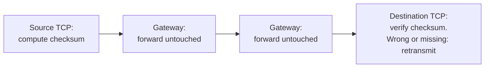

# 4. Reliability at the edges

## The problem: build reliability on top of unreliability

The network loses packets, reorders them, and corrupts them, and the gateway will not fix any of that. So the host's TCP has to manufacture reliability from nothing but the ability to send packets and get some of them back. This chapter is how, and it is worth seeing the mechanics, because they are the concrete form of the architectural bet and the place the paper embodies an idea it never names.

## The checksum that only the ends compute

Start with the sharpest example, because it is the whole philosophy in one detail. Every internetwork packet ends with, in the paper's words, "a trailing check sum used for end-to-end software verification." The source TCP computes it over the packet's text. The destination TCP checks it. And in between, "the GATEWAY does not modify the text and merely forwards the check sum along without computing or recomputing it."

Sit with how deliberate that is. The obvious way to build a reliable path is to check the data at every hop, so each link can catch and repair its own errors. Cerf and Kahn do the opposite. They put one check at the far end, spanning every network on the way, and let every hop between pass the bytes along without inspecting them. If the data was corrupted anywhere, in any network, in any gateway's memory, the single end-to-end check catches it, and the fix is to send the packet again. A per-hop check could not promise as much, because it cannot see corruption that happens between the hops, and it costs work on every link whether or not errors occur. The end check is both more correct and, when errors are rare, cheaper.

## Numbering every byte, and the sliding window

To reorder what arrives out of sequence and to notice what never arrives, TCP numbers data. The scheme is byte-based: imagine the conversation as one infinitely long stream of bytes, and give each byte a sequence number equal to its position in that stream. A packet carries the sequence number of its first text byte and a count of how many bytes it holds. From that, the receiver can place each packet's data at its exact spot in the reconstructed message, even when pieces are still missing, and can tell precisely what gap remains.

On top of the numbers sits recovery and pacing. The sender keeps a window: it may send up to some number of unacknowledged bytes ahead, and no more. On a timeout it retransmits what has not been acknowledged. The receiver acknowledges by returning the next sequence number it expects, which implicitly confirms everything before it, and advances its window. There are no negative acknowledgments; silence plus a timer is how loss is detected. Cerf and Kahn borrow the window idea openly from the French CYCLADES network, and it is the ancestor of the sliding window every TCP uses today. Flow control rides the same machinery: the receiver advertises a "suggested window" telling the sender how much it is currently willing to accept, so a slow receiver can throttle a fast sender without any help from the network.

## An honest note about 1974

It would be easy to read this as full best-effort dogma, the mature internet creed that the network guarantees nothing and the edges must assume the worst. The 1974 paper is more modest. Cerf and Kahn expected host retransmission to be rare. In their words, "it is our expectation that the HOST level retransmission mechanism... will not be called upon very often," and they point out that "individual networks can be effectively constructed without this feature," with the ARPANET as their example. The host mechanism is a safety net for occasional trouble, not a confession that the network is hostile. The harder line, that the network is fundamentally unreliable and the edge must own correctness, sharpened later, as the protocol split and the end-to-end argument was written down. Read 1974 as embodying the instinct, not yet preaching it.

## The idea it embodies but does not name

Everything in this chapter is the end-to-end argument in action: put the function where it can actually be guaranteed, at the endpoints, and treat anything the network does as a performance optimization rather than a correctness guarantee. But the 1974 paper never states that as a principle. It uses the phrase "end-to-end" for the checksum and for "end-to-end restoration procedures," which are mechanisms, not a general law. The principle, that a function like reliability can only be completely and correctly implemented at the endpoints, so the network should not try, was formalized a decade later by Saltzer, Reed, and Clark, and it gets its own seminar next. Cerf and Kahn built the thing; Clark and colleagues named why it works. This seminar is careful to keep the two apart: here is the blueprint that embodies the idea, and the reasoning that justifies it is the chapter that follows this whole seminar.

> **Principle:** Build reliability where it can be guaranteed, at the ends, over the whole path, and let the middle carry bytes without promising anything about them. One check across the entire route beats a check on every link, because only the ends can see whether the data that arrived is the data that was sent.
