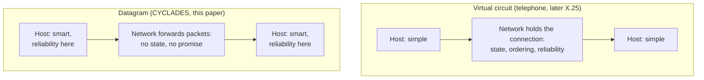

# 5. Datagrams versus virtual circuits

## The problem: where does reliability live?

Everything so far has pointed at one decision, and it is the deepest in the paper. When two processes communicate across a network, someone has to hold the state of that conversation, its sequence, its acknowledgments, its guarantee of in-order delivery. There are two places to put it: inside the network, or at the ends. That choice determines almost everything else, and the two answers had names and champions.

## The two models

One model builds a connection into the network. Before data flows, the network sets up a path, a virtual circuit, and thereafter guarantees that bytes arrive in order and intact, because the switches along the way hold per-connection state and repair errors as they go. The endpoints can be simple, because the network is doing the hard work. This is the telephone model, extended to data, and Cerf and Kahn name its influence directly: "Much of the thinking about process-to-process communication in packet switched networks has been influenced by the ubiquitous telephone system." Two years after this paper, the telephone industry standardized exactly this approach for data as X.25.

The other model puts nothing in the network. Each packet is forwarded on its own, independently, with no connection and no promise of delivery or order, and all the state and all the reliability live in the hosts at the ends. The network is dumb and the endpoints are smart. This is the model of the French CYCLADES network, which Cerf and Kahn cite and borrow from, and CYCLADES is where the word for such a self-contained packet, the datagram, comes from, coined in Louis Pouzin's group and drawing on Donald Davies's packet-switching work at the British National Physical Laboratory.

## What the paper actually says, and does not say

Cerf and Kahn choose the second model, and it is worth being precise about their language, because the famous terms are not theirs. The paper does not contain the word "datagram" or the phrase "virtual circuit." It reaches the connectionless position through its own vocabulary. It reframes the loaded word "connection," which "has a wide variety of meanings" and drags in the telephone system, and replaces it with an association: a relationship between two ports "without regard to a path." It devotes a section to "connection-free protocols with associations," and it insists that "we have not said anything about a path, nor anything which implies that either end be aware of the condition of the other." The endpoints agree to talk; the network is not asked to remember that they are talking.

So the datagram-versus-virtual-circuit framing is the right lens on the decision, but the terms belong to the surrounding debate, not to this paper. The datagram is CYCLADES's word, the virtual circuit is the telephone world's, and X.25 the standard is still two years in the future. What the 1974 paper contributes is the choice, made for internetworking, to keep the network connectionless and push the conversation's state to the hosts.

## Why this is the crux

Follow each fork and you see why this decision determines the rest. If reliability lives in the network, every network in the internetwork must implement it, the gateways between them must maintain per-connection state, and adding a new network means teaching it the guarantees. The system advances at the pace of its slowest, most conservative member, and a single failure inside the network can drop a connection that the switches were nursing. If reliability lives at the ends, the networks can be as dumb and as different as they like, because they promise nothing; a packet can take any path, reroute around a failure, and the endpoints simply notice a gap and resend. New networks join by doing the minimum. The protocol at the edges can be improved without asking a single network operator for permission.

The trade is real, and the virtual circuit was not a foolish choice. Putting reliability in the network gives clean in-order delivery, natural places to bill and prioritize traffic, and simple endpoints, which is exactly what a telephone company optimizing for predictable voice traffic would want. The datagram gives resilience, flexibility, and independence, at the cost of pushing complexity onto every host and offering weaker guarantees inside the network. Cerf and Kahn bet that for interconnecting heterogeneous, independently owned networks, dumb-and-flexible beats smart-and-rigid. The internet is what that bet became, and the telephone industry's smart network, for data, is what it replaced.

> **Principle:** The most consequential choice in a communication system is where the reliability lives. Put it in the network and every part must be smart and the whole moves at the pace of the slowest. Put it at the edges and the middle can stay dumb, diverse, and free to change. The internet is the second choice, made on purpose.
