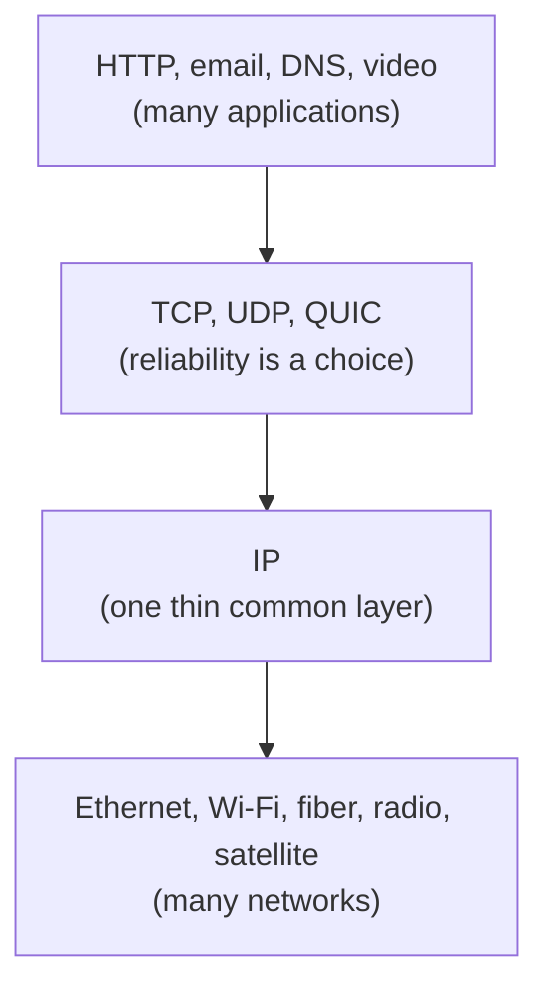

# 7. Modern echoes

The 1974 architecture is not an ancestor of the internet; it is the internet, still running, with its packaging rebuilt around it. This chapter maps the surviving shape onto the network we have, and marks which pieces are Cerf and Kahn's and which are later framings laid on top.

## The hourglass, a later name for their shape

The split of chapter 6 produced a structure that a later generation drew as an hourglass: many applications at the top, many network technologies at the bottom, and one thin layer in the middle that everything passes through. IP is the narrow waist. Above it, TCP and UDP and now QUIC; below it, Ethernet, Wi-Fi, fiber, cellular radio, satellite. Anything can run over IP, and IP can run over anything, because the waist is deliberately minimal.

The hourglass metaphor is not in the paper; it was popularized decades later, notably in Steve Deering's talk on watching the waist of the protocol hourglass in the late 1990s. But the thing it describes is exactly what Cerf and Kahn built: one common internetwork format that hides the diversity of the networks below from the applications above. Mark the picture as a descendant framing, and read it as confirmation that the bet paid off. The waist stayed thin because they refused to put reliability or connections into it.

## Gateways became routers, and the network of networks became BGP

Cerf and Kahn's gateways are today's routers, and their handful of independently owned networks is now the global routing system. The internet is a network of tens of thousands of independently operated networks, called autonomous systems, each running itself however it likes and exchanging reachability with its neighbors through the Border Gateway Protocol, standardized in 1989 and still, in its fourth version, how the internet's backbone routes. This is the 1974 picture at planetary scale, and it kept the 1974 property that mattered most: no network has to trust or understand another's internals, it only has to agree on the format at the boundary and announce what it can reach. When people worry that BGP is held together by trust and duct tape, they are describing the cost of Cerf and Kahn's bet that networks should stay independent and the interconnect should stay dumb.

## Fragmentation lost; the instinct behind it won

The 1974 gateways fragment packets and leave reassembly to the destination host. The reassembly-at-the-edge instinct was right and endured, but in-network fragmentation itself did not. It turned out to hurt performance and reliability, so the modern approach flips it: instead of letting routers split packets, the source discovers the smallest packet size along the whole path, through Path MTU Discovery, and sizes its packets to fit. IPv6 finished the job by forbidding routers to fragment at all, leaving only the source to do it. So the specific mechanism the paper spends pages on was retired, while the principle underneath it, do not make the middle hold state or do work it can push to the edge, is exactly why it was retired.

## QUIC moves reliability back to the edge, again

The most striking modern echo is a repeat of the original move. For decades TCP lived in the operating-system kernel, and that made it almost impossible to change, because every host and every middlebox had baked in assumptions about it. So the designers of QUIC, now standardized and carrying much of the web under HTTP/3, rebuilt reliability, ordering, and congestion control as a protocol running in userspace on top of UDP, which is to say on top of the bare datagram service. This is Cerf and Kahn's architecture applied to escape the ossification of their own success: when the reliable transport got stuck, they dropped down to the dumb datagram layer and built a new smart edge above it. Reliability went back to the host, one layer up, exactly where the 1974 paper put it.

## The middle grew intelligence, and that is the tension

The honest counter-theme is that the pure architecture eroded. Network address translation, introduced in the 1990s to stretch the small address space, put boxes in the path that rewrite addresses and hold per-flow state, the very thing gateways were designed not to do. Firewalls and other middleboxes inspect and modify traffic in transit. Each of these is useful and each chips at the principle that the network only carries data while the hosts do the rest, and together they made the internet hard to change, because a new transport protocol now has to survive every middlebox on the path. That ossification is precisely why QUIC hides inside UDP and encrypts almost everything, so the middle cannot see enough to interfere. The end-to-end architecture is not a settled fact; it is under constant pressure from a middle that keeps getting smarter, and much of modern protocol design is a running argument with that pressure.

That argument is the subject of the seminar that follows. Cerf and Kahn drew the architecture; David Clark and colleagues named the principle that justifies keeping the middle dumb, the end-to-end argument, and Clark later chronicled the forces, middleboxes among them, pushing back on it. Read this seminar for the blueprint, and the next for the reasoning and the reckoning.

> **Principle:** The architecture outlived its every mechanism. Fragmentation, the monolithic protocol, even the address size were all replaced, while the shape, a thin common waist over independent networks with intelligence at the edges, held. When the edges ossified, the answer was to drop to the dumb layer and build a new edge, which is the original move made again.
