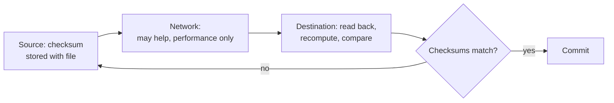

# 1. The principle, stated carefully

## The problem: where does a function belong?

Saltzer, Reed, and Clark open on the decision they think matters most: "Choosing the proper boundaries between functions is perhaps the primary activity of the computer system designer." In a system with a communication subsystem, there is a list of functions, reliable delivery, encryption, duplicate suppression, ordering, that could be implemented in any of several places: by the network, by the endpoints, jointly, or redundantly by both. The tempting move is to put such a function into the network, so every application gets it for free. The end-to-end argument is a warning against that move, and its precision is what makes it more than a preference.

## The move: the exact claim

Here is the argument in the authors' own words, and the parenthetical at the end is the part that gets dropped:

> The function in question can completely and correctly be implemented only with the knowledge and help of the application standing at the end points of the communication system. Therefore, providing that questioned function as a feature of the communication system itself is not possible. (Sometimes an incomplete version of the function provided by the communication system may be useful as a performance enhancement.)

Two things are load-bearing. The claim is about complete and correct implementation, and it turns on the application's knowledge. And the parenthetical concedes, immediately, that a lower layer may still implement an incomplete version of the function, purely to go faster. Hold onto both. Note also the authorship: this is Saltzer, Reed, and Clark in 1984, revised from a 1981 conference paper, and the lead author is the Saltzer of the protection seminar. Clark anchors this seminar, but the principle is not his alone.

## Why the network cannot guarantee correctness

The argument earns its claim with an example that has been taught ever since: careful file transfer. Move a file from host A to host B intact, knowing that failures can strike anywhere. The threats are not only in the network. The disk at A may return bad bits. A buffer-copy bug in the file system or the transfer program may corrupt data at either host. The processor may have a transient error. And either host may crash partway through. The network is only one of five places the transfer can go wrong.

So the careful application does an end-to-end check: store a checksum with the file, transfer it, then at B read the file back off the disk, recompute the checksum, and compare it with A's. Commit only if they match; retry if they do not. Now ask what happens if the network is made internally reliable, with its own packet checksums and retries. The answer is the crux: the application must still do its own end-to-end check, because the network's reliability does nothing about the disk error, the buffer bug, or the crash. Making the network reliable "has no effect on inevitability or correctness of the outcome," and "does not reduce the burden on the application program to ensure reliability." The endpoints have to check regardless, so the network's internal guarantee is redundant for correctness.

The paper drives it home with a "too-real" failure from MIT. A gateway had a transient bug that swapped a pair of bytes about once in a million, and it did so while the data sat in its memory, between the per-hop checksums. Applications trusted those per-hop checks and assumed the transfer was reliable. Source files were silently corrupted, and their owners ended up doing the ultimate end-to-end check by hand, comparing against old printouts. A check on every hop did not catch an error that happened between the hops. Only a check across the whole path, at the endpoints, could.

## The nuance that is the whole point

It would be easy to stop there and conclude that the network should do nothing. The authors explicitly refuse that reading: "It would be too simplistic to conclude that the lower levels should play no part in obtaining reliability, however." Consider a network that drops one message in a hundred. With end-only retransmission, the chance a whole file arrives intact falls off exponentially with its length, so the expected transfer time explodes. Some reliability in the network cuts that cost dramatically. "But the key idea here is that the lower levels need not provide 'perfect' reliability." The conclusion is a distinction, not a prohibition: "the amount of effort to put into reliability measures within the data communication system is seen to be an engineering tradeoff based on performance, rather than a requirement for correctness."

That sentence is the argument. Correctness lives at the endpoints and can live nowhere else, so the network cannot be trusted to provide it. Performance is a separate question, and for performance the network may absolutely help, as long as it does not pretend to be providing correctness. A wireless link that retransmits a lost frame is not violating the end-to-end argument; it is doing the permitted thing, improving performance while the endpoints still own correctness. Almost every real argument about end-to-end that goes wrong goes wrong by collapsing these two into one and declaring that any function in the network is a violation. It is not. Function in the network for correctness is the mistake. Function in the network for performance is a tradeoff the authors invite you to make with care.

> **Principle:** Put a function below the endpoints only if it can be completely and correctly implemented there, which for most interesting functions it cannot, because only the endpoints have the knowledge to check the result. Everything the network does toward that function is then a performance optimization, never a correctness guarantee, and confusing the two is the classic misreading.
