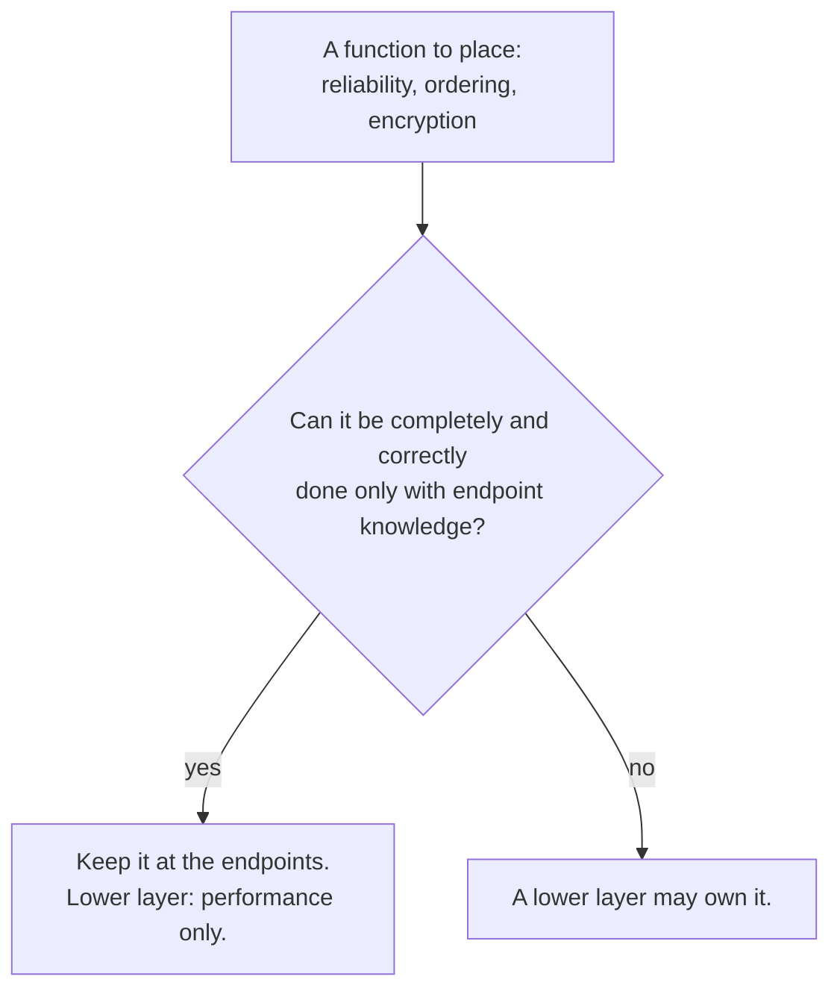

# 2. A guideline, not a dumb network

## The problem: one example is not a law

The file transfer is one case. If the end-to-end argument were only about checksums, it would be a footnote. Its authors spend the rest of the 1984 paper showing that the same reasoning applies to function after function, and, just as important, that applying it requires judgment. The argument is a way of asking a question, not a slogan that hands you an answer, and the answer changes when the question is posed carefully.

## The same reasoning, function after function

Watch the argument generalize. Take delivery acknowledgments. A network can easily confirm that it delivered a message; the ARPANET returned a packet called a Request For Next Message for this. But that confirmation was rarely useful to applications, because knowing the message reached the far host says nothing about whether the host acted on it. What the application wants is an acknowledgment only its counterpart can give: "I did it," or "I didn't." That is an end-to-end acknowledgment, and no amount of network machinery can produce it.

Encryption tells the same story with a twist. If the application encrypts end to end, it gets what it actually needs: authentication of the message, control of its own keys, and data that is never exposed in the clear outside the application. Network-level encryption cannot provide those, because the data is decrypted on the way into the host and the network must be trusted with the keys. The authors note the two are complementary rather than redundant: automatic network encryption is useful as "one more firewall" to stop a misbehaving user from leaking data out, which is a different requirement from authenticating a user's access. Two functions that look identical turn out to belong at different levels once you ask what each is really for.

Duplicate suppression, message ordering, and two-phase commit all fall to the same analysis. An application generates its own duplicates when it retries after a silence, and the network cannot see those as duplicates, so the application must suppress them regardless, which means the network need not. Ordering across several sites cannot be guaranteed by a network that only orders one connection at a time. The atomic-commit protocols of Gray and Reed are end-to-end precisely because they cannot depend on the network being reliable or in-order, since other components fail too.

## Identify the ends

The subtlest part of the paper is a warning that the argument can be misapplied if you do not know where the endpoints are. The example is packet voice. For two people in a real-time conversation, an unusually strong version of the argument holds: if the network tries for bit-perfect delivery by retransmitting damaged packets, it introduces delays that wreck the conversation, so it is better to accept a damaged packet, or replace it with a little silence, and let the humans correct by saying "would you please repeat that." The ends are the people, and the people want timeliness over perfection.

Now store the same voice packets in a file for later listening, and the analysis inverts. Delay no longer matters, because nobody is waiting in real time, and accuracy matters more, because the listener later cannot ask the speaker to repeat. Reliability measures that were harmful for the live call are helpful for the recording. Same data, opposite conclusion, because the endpoints changed. The authors draw the lesson explicitly: "the end-to-end argument is not an absolute rule, but rather a guideline that helps in application and protocol design analysis; one must use some care to identify the end points to which the argument should be applied."

## Why this is not "make the network dumb"

This is where the popular version of the argument goes wrong. The end-to-end argument is often compressed to "dumb network, smart edges," and later to Isenberg's memorable "stupid network." Those phrases capture a consequence, but they are not the argument, and they mislead. The network in question is not dumb: it provides best-effort delivery, addressing, and routing, and the argument explicitly permits it to provide performance help. What the argument actually delivers is a criterion for placing each function: ask whether it can be completely and correctly implemented only with the knowledge of the endpoints, and if so, keep it there and let any lower-level version be a performance optimization. That is a design analysis, not a demand for a stupid core.

The authors themselves point at the reach of the criterion. They note that the whole debate over datagrams versus virtual circuits, the crux of the previous seminar, is really a debate about end-to-end arguments: a virtual circuit hands you a reliable, ordered, duplicate-free stream that is pleasant to build on, while the end-to-end argument says those central guarantees will be incomplete for some applications, which will find it easier to build what they need on top of plain datagrams. So the end-to-end argument is the reasoning that justifies the connectionless core Cerf and Kahn chose. And it is not only about networks: the paper likens it to the RISC argument, that a client gets better performance building from primitives than from features the designer guessed at, and to Lampson's open operating system, where any function the system provides should be replaceable by an application's own version. Function placement is the general problem; the network is just where the argument bites hardest.

> **Principle:** End-to-end is a question, not a slogan: for each function, can it be completely and correctly implemented only at the endpoints? Answering it well means identifying the true endpoints first, because the same data can have different ends, and the answer, not a blanket "dumb network," is what tells you where the function belongs.
