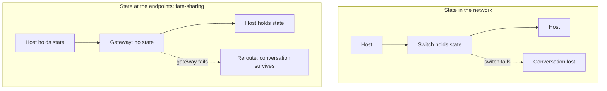

# 4. Fate-sharing

## The problem: a conversation has state, and state can be lost

Survivability was the first goal, and Clark reads it strictly. If a failure disrupts the network and it reconfigures around the damage, two communicating entities "should be able to continue without having to reestablish or reset the high level state of their conversation." He pushes this to an absolute: "at the top of transport, there is only one failure, and it is total partition. The architecture was to mask completely any transient failure." As long as any physical path exists, the conversation must survive, invisibly.

That is a demanding promise, because a conversation is not stateless. Someone has to remember how many packets were sent, how many were acknowledged, how much the flow-control window allows. If that state is lost, the two ends fall out of sync and the conversation breaks even though the network is fine. So the question survivability forces is: where do you keep the state so that a failure cannot destroy it?

## Two answers, and the one the internet chose

There are two places to put it. You can keep the state inside the network, in the switching nodes, and protect it by replicating it across several of them so that no single failure loses it. This is possible, but Clark notes it is hard: "algorithms to ensure robust replication are themselves difficult to build, and few networks with distributed state information provide any sort of protection against failure." Replication also protects you only up to a point, against fewer failures than you have copies.

Or you can do what the internet did. Clark names it: "The alternative, which this architecture chose, is to take this information and gather it at the endpoint of the net, at the entity which is utilizing the service of the network. I call this approach to reliability 'fate-sharing.' The fate-sharing model suggests that it is acceptable to lose the state information associated with an entity if, at the same time, the entity itself is lost." Keep the conversation's state in the two hosts having the conversation. Then the only failure that destroys the state is the failure of a host, and if your peer is gone, there was nothing left to talk to anyway. The state shares the fate of the thing it describes.

Fate-sharing beats replication on two counts, both of which Clark states. It "protects against any number of intermediate failures, whereas replication can only protect against a certain number." And it is "much easier to engineer." You do not need consensus among switches about whose copy of the state is authoritative; you need each host to remember its own conversations, which it was going to do anyway.

## Why this is the reason the core is stateless

Fate-sharing has two consequences, and they are the deep explanation for the design the previous seminar simply presented. In Clark's words: "First, the intermediate packet switching nodes, or gateways, must not have any essential state information about on-going connections. Instead, they are stateless packet switches, a class of network design sometimes called a 'datagram' network. Secondly, rather more trust is placed in the host machine than in an architecture where the network ensures the reliable delivery of data."

That first consequence is the punchline of the whole internet-architecture pair. Cerf and Kahn chose a connectionless, stateless datagram core, and this seminar can now say why: survivability demanded that a conversation survive the loss of any gateway, fate-sharing was the way to guarantee that, and a network whose switches hold no conversation state is what fate-sharing produces. The datagram is not an arbitrary choice or merely an efficiency; it is what you get when you insist the network can lose any of its pieces without losing anyone's conversation. A gateway can crash, and because it held nothing essential, the packets simply route around it and the endpoints, which still hold the state, never notice more than a delay.

## The trust it borrows, and later regrets

The second consequence is quieter and turns out to matter enormously. Fate-sharing places more trust in the host. If the reliability machinery lives in the host, then a badly behaved host can hurt not only itself but the network. Clark saw the edge of this even in 1988, and states it with unusual candor: "the goal of robustness, which led to the method of fate-sharing, which led to host-resident algorithms, contributes to a loss of robustness if the host mis-behaves." The design bought survivability against network failure by betting on host good behavior. That bet was safe among a few cooperating research hosts. It becomes the central problem when the hosts are billions of strangers, some of them hostile, which is precisely where the reckoning two chapters on will pick up. Fate-sharing is the mechanism that made the internet survivable, and the trust it assumed is the thing the modern internet can no longer take for granted.

> **Principle:** Keep a thing's state where it shares that thing's fate. Put the conversation's state in the endpoints and no intermediate failure can destroy what the endpoints still hold, which is how you build a network that survives losing its pieces. The cost is hidden in the second clause: you are now trusting the endpoints, and that trust is only as good as the endpoints are.
