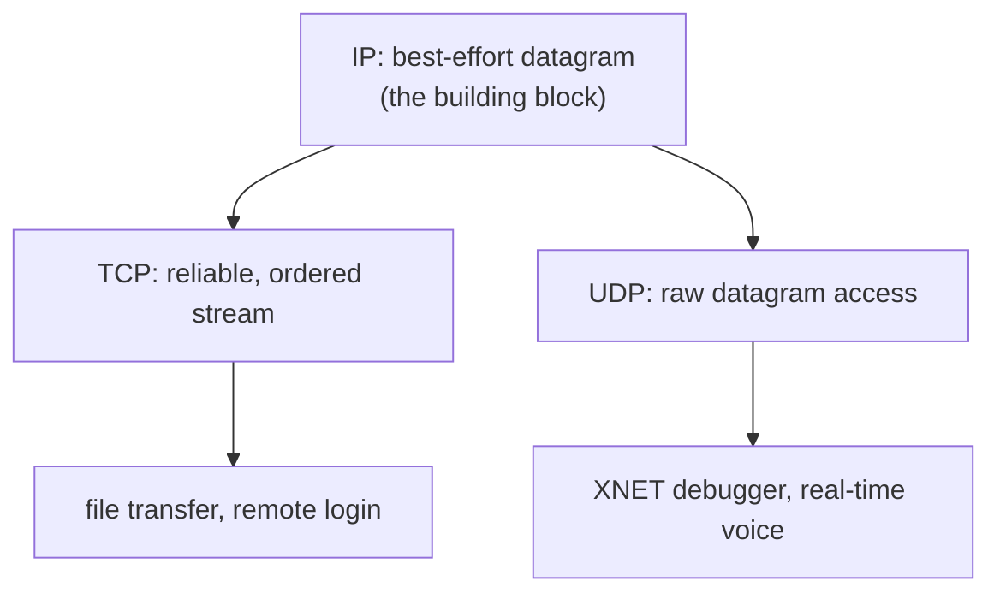

# 5. Types of service, and the split

## The problem: one protocol cannot be all services

The previous seminar dated the moment the one monolithic protocol split into TCP and IP: worked out in the late 1970s, standardized in 1981. This chapter gives Clark's reason for it, which is the second goal on his list, support for multiple types of service, and it is a cleaner explanation than the dates alone.

The original plan was that TCP would be general enough to serve any application. That held until specific applications refused to fit. Clark gives two. The first is XNET, a debugger meant to work across the internet, and his conclusion about it is delightfully counterintuitive: "a debugger protocol should not be reliable." Under the stress or failure conditions when you actually need a debugger, "asking for reliable communications may prevent any communications at all," because reliable delivery will stall waiting for a retransmission of the very link that is failing. Better to work with whatever bytes get through. The second is real-time digitized speech, for command-and-control teleconferencing, which needs delay to be low and smooth rather than reliable. And Clark names the villain precisely: "the most serious source of delay in networks is the mechanism to provide reliable delivery." A reliable protocol responds to a lost packet by holding everything after it until the retransmission arrives, which is exactly the delay spike that wrecks a voice stream. A missing packet of speech is better replaced with a moment of silence.

## The move: a building block, not a service

Reliability was wonderful for file transfer and ruinous for voice, and one protocol could not do both. So, in Clark's words, "This goal caused TCP and IP, which originally had been a single protocol in the architecture, to be separated into two layers. TCP provided one particular type of service, the reliable sequenced data stream, while IP attempted to provide a basic building block out of which a variety of types of service could be built. This building block was the datagram." The delivery of a datagram "was not guaranteed, but 'best effort,'" so you could build reliability on top by acknowledging and retransmitting, or you could skip reliability and get raw timeliness. UDP was added to give applications direct access to the bare datagram, and XNET and voice ran on that.

A small dating note worth making, because the previous seminar leaned on it: the phrase "best effort" appears here, in 1988, in quotation marks. It was absent from Cerf and Kahn's 1974 paper. The term for a network that promises to try and nothing more hardened somewhere in between, as the datagram went from an implementation choice to the defining commitment of the architecture.

Clark is emphatic that the datagram is a building block, not a service, and warns against a specific confusion: "There is a mistaken assumption often associated with datagrams, which is that the motivation for datagrams is the support of a higher level service which is essentially equivalent to the datagram." Almost no application wants a bare datagram service; they want reliability, or smoothed delay, or something else built from datagrams. The datagram is deliberately elemental so that the endpoints can compose whatever they need, which is the end-to-end argument wearing its architecture clothes: give the middle the minimum, and let the ends build up.

## Clark's own second thoughts

What makes the 1988 paper more than a victory lap is that Clark turns on the datagram at the end, and in doing so previews the reckoning. The datagram served the top goals beautifully and the bottom goals badly. Resource management and accounting, ranked last, "have proved difficult to achieve in the context of datagrams," and he explains why: most datagrams are part of a sequence from one source to one destination, "however, the gateway cannot directly see the existence of this sequence, because it is forced to deal with each packet in isolation." A stateless core that treats every packet as unrelated to every other has thrown away the very information you would need to manage or bill a flow of traffic. The minimalism that bought survivability made accountability nearly impossible, exactly as the goal ordering predicted.

So Clark sketches what he would reach for next. He proposes a richer building block than the datagram, "a sequence of packets traveling from the source to the destination," which he calls a flow, and which would require gateways to hold "flow state." To keep that from breaking fate-sharing, he introduces a concept: "I call this concept 'soft state,' and it may very well permit us to achieve our primary goals of survivability and flexibility, while at the same time doing a better job of dealing with the issue of resource management and accountability." Soft state is state a gateway may hold but does not have to preserve, because the endpoints refresh it periodically and it can be rebuilt after a loss without disrupting the conversation. It is fate-sharing softened: the middle may keep a helpful copy, but the endpoints remain the source of truth. Soft state and flows would reappear for decades in reservation protocols, quality-of-service schemes, and software-defined networking, all of them attempts to give the core just enough memory to manage traffic without giving up the survivability that statelessness bought.

> **Principle:** Do not compile one service into the core; provide the minimum building block and let the endpoints compose the services they need. The datagram was that minimum, and it worked so well for survivability that it made accounting and management hard, a tradeoff Clark saw clearly enough to start designing his way back out of it.
