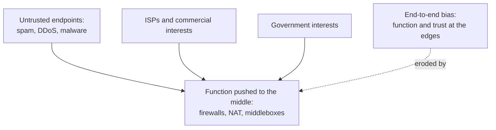

# 6. The reckoning

## The problem: the assumption that stopped being true

There is a sentence buried in the file-transfer example that the whole end-to-end world rested on. The endpoints, it assumes, are "in willing cooperation to achieve their goals." That was true when the internet was a few hundred research machines run by people who knew each other. It is the assumption Clark himself came back to demolish, first with Marjory Blumenthal in 2001 and then with colleagues in 2002, in two papers that are as important as the principle they revise. A seminar that stops at the triumph has read half the story.

The 2001 paper, "Rethinking the Design of the Internet," names the shift directly: "The examples in the original end-to-end paper assume that the end-points are in willing cooperation to achieve their goals. Today, there is less and less reason to believe that we can trust other end-points to behave as desired." The consequences are the daily weather of the modern internet: attacks on the network, attacks on individual machines, spam, and the general problem that a large fraction of the endpoints are now operated by people whose interests are hostile to yours. And here is the mechanism of erosion, in Clark and Blumenthal's own words: "Making the network more trustworthy, while the end-points cannot be trusted, seems to imply more mechanism in the center of the network to enforce 'good' behavior."

That is the reckoning in one line. The end-to-end argument put function at the edges and, implicitly, trusted the edges. When the edges can no longer be trusted, the pressure is to move function back into the middle, exactly where the argument said it should not go. Firewalls inspect and block. Network address translators rewrite. Middleboxes filter, cache, and police. None of these existed in the clean end-to-end picture, and all of them exist because someone decided the endpoints could not be left to their own behavior.

## Four forces, not one

Loss of trust is the sharpest force, but the 2001 paper links the erosion to a set of trends, and the others are about money and power rather than security. New stakeholders arrived, above all the internet service providers, who have commercial interests in shaping, prioritizing, and monetizing traffic that a neutral edge-to-edge pipe does not serve. Governments arrived, with interests in surveillance, censorship, and control that require inserting themselves into the middle. And the user base changed, growing from experts to everyone, with a corresponding range of motivations, some of which the earlier internet would have called abuse. Each of these wants something the end-to-end architecture was built not to provide, and each pushes function and control toward the core.

The cost of giving in, Clark warns, is the very thing that made the internet valuable. The generality of the core, the property that let anyone deploy a new application without permission, is what erodes when the middle fills with boxes that understand and police specific traffic. A new protocol now has to survive every firewall and middlebox on the path, which is the ossification the previous seminar described and the reason a new transport like QUIC has to disguise itself inside UDP. The internet "might lose some of its key features, in particular its ability to support new and unanticipated applications." The reckoning is not that end-to-end was wrong. Clark is careful, even here, to repeat that the argument was "not offered as an absolute" and that performance and efficiency can justify features in the core. The reckoning is that the world the argument assumed, cooperating and trusted endpoints, is gone, and the architecture has to reckon with its absence.

## From principle to tussle

The 2002 paper, "Tussle in Cyberspace," goes further and reframes the whole enterprise. The internet, Clark and his coauthors write, "was created in simpler times," when "all the players, whether designers, users or operators, shared a consistent vision and a common sense of purpose." That common purpose "no longer prevails." In its place are stakeholders "with interests directly at odds with each other": music listeners and rights holders, people who want private conversations and governments who want to tap them, ISPs who must interconnect to make the internet work and yet compete fiercely with each other. They give this permanent conflict a name: "the tussle."

The design lesson is a hard one for engineers who like clean principles. You cannot design the tussle away, and you should not try to hardwire one side's victory into the architecture. Instead you "design for tussle": design so that the outcome can vary from place to place, so the fight happens within the architecture rather than by breaking it; modularize the design so one tussle does not spill into unrelated parts; and design for choice, so competition keeps working. End-to-end, in this frame, is no longer the definition of a correct internet. It is one value, held by some players, contending with others. That is a remarkable place for the man who did more than anyone to articulate the principle to end up: not defending it as doctrine, but treating it as one interest in an arena of interests, and asking how to build a network that survives the fight.

> **Principle:** The end-to-end internet assumed endpoints that cooperate and a community with a common purpose. When trust between endpoints fails and interests diverge, function and control migrate to the middle, and no principle can hold them out by fiat. Design for the tussle you actually have, not the harmony you wish you had.
