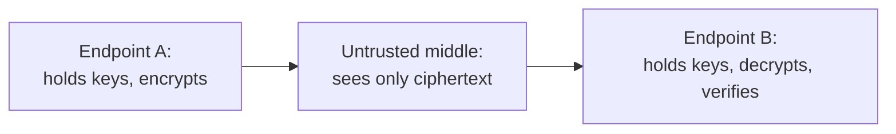

# 7. Modern echoes

The end-to-end argument, the goals, and the reckoning are not history; they are the running argument inside every system that spans a network you do not control. Here is where each idea lives now, kept precise, and read through the reckoning as much as the principle.

## End-to-end encryption: the principle reasserted against an untrusted middle

The single largest modern echo is the one the reckoning predicted. If the middle of the network cannot be trusted, and it cannot, then the endpoints protect themselves by encrypting so thoroughly that the middle can only carry opaque bytes. This is the 1984 encryption example come true at scale. HTTPS is now nearly universal, so the network sees ciphertext rather than content. Signal and its imitators put end-to-end encryption in messaging, so not even the service provider in the middle can read the messages. And QUIC encrypts not just the payload but most of the transport header itself, so middleboxes cannot read or rewrite the connection's control information.

There is a satisfying symmetry here. The reckoning said that untrusted endpoints push function into the middle. End-to-end encryption is the endpoints pushing back, defending themselves against an untrusted middle by keeping confidentiality and integrity where the 1984 paper always said they belonged, at the ends. It is also, as the previous seminar noted, an anti-ossification move: QUIC encrypts its headers partly so that middleboxes cannot come to depend on them and freeze the protocol. The principle and the reckoning are fighting each other inside a single protocol, and encryption is how the endpoints win back ground.

## Middleboxes and the performance clause

The reckoning listed firewalls, NAT, and middleboxes as the erosion of end-to-end, and the honest reading uses the correctness-versus-performance distinction rather than crying violation at everything in the path. A content delivery network that caches copies near users is a performance optimization, exactly the kind the argument permits: the origin remains the source of truth, the cache is checked and invalidated, and correctness still lives at the ends. A service mesh that moves retries, mutual TLS, and observability into sidecars is function pulled out of the application, but the sidecar sits with the host, at the edge, and mostly serves performance and operations rather than redefining correctness. A transparent proxy or a firewall that inspects and rewrites traffic to enforce a policy is the harder case, function placed in the middle for reasons the endpoints did not choose, which is closer to the thing the argument warns against.

The point is not to score each box as pure or impure. It is that the 1984 distinction still does real work: ask whether the middle box is helping performance while the endpoints keep correctness, or whether it has taken over a correctness or policy decision that the endpoints can no longer make for themselves. The first is the tradeoff the argument invites. The second is the erosion the reckoning documents. Most real middleboxes are a mixture, and knowing which part is which is exactly the analysis the argument was written to enable.

## Fate-sharing as stateless services

Fate-sharing left the network and moved up the stack. The modern rule that services should be stateless is fate-sharing applied to servers: keep a session's state with the client, not pinned to a particular server instance, so that any instance can die or restart without destroying the session, because the state shares the client's fate rather than the server's. A stateless REST service holds no per-client conversation between requests. A JSON Web Token carries the session's state in the request itself, signed, so any server can serve any request. The twelve-factor guideline that processes be stateless and share-nothing is the same instinct, and it is what makes horizontal scaling, load balancing across interchangeable instances, and serverless functions possible at all. Clark's rule for surviving the loss of a gateway is the rule for surviving the loss of a server: put the state where it shares fate with the thing it describes, and the intermediate machines become disposable.

## Zero trust, and where the trust went

The reckoning's deepest theme, that you can no longer trust the other party, is the founding premise of the security world's zero trust model, and the connection runs back to the protection seminar through their shared author. Saltzer co-wrote both the end-to-end argument and, with Schroeder, the protection principles, and the two meet here. Zero trust says: trust nothing because of where it sits on the network, and verify every request, which is the reference monitor and complete mediation from the protection seminar carried onto a network whose middle and endpoints are both suspect. The end-to-end internet assumed cooperating, trusted endpoints; zero trust is what security looks like once that assumption is abandoned entirely. The trust that fate-sharing placed in the host, and that the 1984 examples placed in the endpoints, is exactly the trust that modern security refuses to extend.

One echo to keep at arm's length. Network neutrality, the policy debate about whether ISPs may discriminate among traffic, invokes the end-to-end argument constantly, and for good reason, since a neutral pipe is what end-to-end produces. But it is a later policy overlay, argued in the 2000s and named by Tim Wu around 2003, not the original technical claim. The end-to-end argument is about where a function can be correctly implemented; network neutrality is about what regulators should permit carriers to do. They are related, and they are not the same, and reading the policy back into the 1984 paper flattens both.

## Where this leaves the internet arc

Cerf and Kahn drew the architecture; Clark supplied the reasoning and then the reckoning. Together they answer the book's oldest question, where function and trust should live, more sharply than any other pair in the series, and their answer has an expiry clause: at the edges, as long as the edges can be trusted, and the modern internet is the long argument about what to do when they cannot. That question does not close here. It reopens as the series turns to how unreliable, untrusted machines can nonetheless agree on a single history, which is the problem of consensus, and the next reason the endpoints cannot simply be left alone.

> **Principle:** The endpoints defend correctness against an untrusted middle by encrypting end to end; the middle earns its keep as performance, not correctness; state lives where it shares fate; and once no party can be trusted by position, security becomes verify-everything. The end-to-end world was the world where endpoints could be trusted, and most of modern systems design is the response to losing that world.
