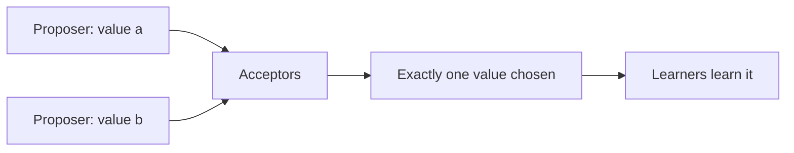

# 1. The consensus problem

## The problem: agree on one thing, despite everything

Strip away the allegory and the reputation, and Paxos answers a question that sounds almost too simple to be hard. A group of processes each has a value in mind. They must agree on exactly one of them. That is consensus, and it is the quiet engine under most of distributed systems, because of what agreeing once lets you do. Agree on one value, then agree on a second, then a third, and you have an agreed-upon ordered sequence: a log. Feed that log as commands to identical deterministic state machines and they stay in lockstep, so a service survives the loss of any of its copies. This is the state-machine approach, the idea Lamport himself seeded in his 1978 work on ordering, and Paxos is what makes it tolerate failure. The fourth seminar built the frame; this one supplies the agreement.

## What agreement requires

Lamport states consensus as three safety requirements, and they are worth keeping exact:

- Only a value that has been proposed may be chosen.
- Only a single value is chosen.
- A process never learns that a value has been chosen unless it actually has been.

The first keeps the algorithm honest, it cannot invent a value. The second is the point, agreement. The third keeps learners from acting on a phantom. Notice what is deliberately vague: liveness. Lamport declines to specify it precisely, asking only that "some proposed value is eventually chosen" and that a chosen value can eventually be learned. That vagueness is not sloppiness. It is a confession, and the fourth chapter will show why it has to be.

## Three roles

The protocol splits the work into three roles, and separating them is what makes it tractable. Proposers put values forward. Acceptors are the memory of the system; they accept proposals, and a value counts as chosen when enough acceptors have accepted it. Learners find out what was chosen and act on it. In a real system one process plays all three roles at once, but the algorithm reasons about them separately, and keeping them separate keeps the argument clean.

## The model, and the reason it is hard

Everything turns on the failure model, so Lamport fixes it precisely: the "customary asynchronous, non-Byzantine model." Processes run at arbitrary speeds, may fail by stopping, and may restart. Because a process can crash after a value is chosen and then come back, it must be able to remember what it accepted across a restart, which is why acceptors need stable storage. Messages can be delayed for any length of time, lost, or duplicated, but they are not corrupted and no one lies. That last clause matters: Paxos tolerates crashes, not treachery. The Byzantine case, where a component actively misbehaves, is a later seminar.

The deep difficulty hides in the word asynchronous. There is no bound on how long a message can take, so a process that is waiting for a reply cannot tell the difference between a peer that has crashed and a peer that is merely slow, or between a lost message and one still in flight. This is the world the fourth seminar described, the one with no global clock and no reliable "now." You cannot solve consensus by waiting for everyone, because "everyone" might include a process that will never answer, and you cannot tell that process apart from one that is about to. That single indistinguishability, dead versus slow, is what makes guaranteed consensus impossible in the general case, a result the fourth chapter here will name in full. Paxos does not escape it. What it does is separate the two things at stake: it guarantees agreement no matter how badly the timing behaves, and it makes progress whenever the timing behaves well enough. Holding those two apart, safety always and progress sometimes, is the key to reading the whole protocol, and it is where most misreadings go wrong.

The algorithm is called Paxos, after a fictional Aegean island in the allegory Lamport wrapped it in. Why a distributed algorithm is named for a Greek parliament is a story worth telling, but it is best told after the protocol makes sense, so it waits for the sixth chapter.

> **Principle:** Consensus is getting unreliable processes to agree on one value when none of them can tell a dead peer from a slow one. Solve it once and you can agree on an ordered log, which is how a service survives the loss of its parts. The trick is to separate what must always hold, agreement, from what can only sometimes hold, progress.
