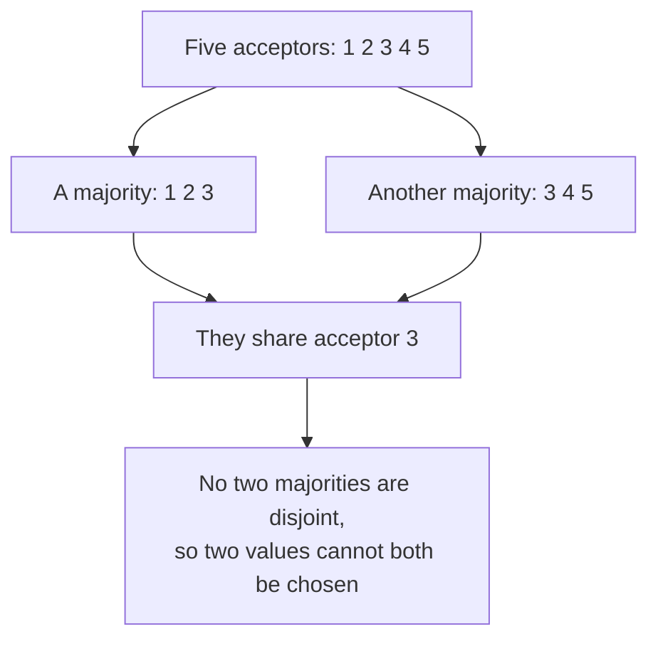

# 2. Majorities intersect

## The problem: who decides a value is chosen?

Start with the simplest design and watch it fail, because the failures teach the protocol. Let one acceptor decide: a proposer sends it a value, it keeps the first one it receives, done. This satisfies agreement trivially, and it is useless, because the moment that single acceptor crashes, no one can learn the value and no new value can be chosen. A consensus algorithm whose whole memory sits in one process is not fault-tolerant at all.

So use many acceptors, and say a value is chosen when enough of them accept it. Everything now depends on what "enough" means. If "enough" is too few, two different values could each be accepted by a separate group, and you would have chosen two values, violating agreement. If "enough" is everyone, a single crash blocks all progress. The right threshold has to be large enough that two different groups cannot both clear it, yet small enough to survive failures.

## The one fact the protocol rests on

Lamport's answer is a majority, and the reason is a fact so simple it is easy to undervalue: any two majorities of a set share at least one member. There is no way to carve a set into two majorities that do not overlap, because together they would have to contain more than all the elements. So if a value is chosen only when a majority of acceptors accept it, and if each acceptor accepts at most one value, then two different values can never both be chosen, because the acceptor in the overlap would have had to accept both, and it accepts only one.

That is the entire foundation of agreement. Not a clever data structure, not a timing assumption, just the arithmetic of overlapping majorities. Everything else in Paxos exists to preserve this guarantee under the messiness of real execution.

## It is intersection, not majority

The word "majority" is the simplest way to get the property, but it is not the property itself. What matters is that any two quorums, any two groups large enough to choose, must intersect. Lamport notes the generalization explicitly: you can use any quorum system in which every pair of quorums shares a member, and the same safety argument goes through. Weighted schemes where some acceptors count for more, grid quorums, and other arrangements all work as long as intersection holds. Majority is just the canonical intersecting quorum, the one you reach for when all acceptors are equal.

This is the same arithmetic the fifth seminar met from the systems side. Viewstamped Replication needs 2f+1 replicas to tolerate f crash failures, because then any f+1 form a majority and any two such majorities intersect in at least one replica that survived. Paxos and VR arrive at the identical requirement by the identical reasoning, from opposite directions, which is the first sign of how deeply the two are the same idea, a point the sixth chapter returns to.

## The catch that forces the rest of the protocol

There is a problem hiding in "each acceptor accepts at most one value," and it is what makes Paxos more than a paragraph. Suppose acceptors must accept the first proposal they receive and nothing else. Three proposers wake up at once with three values, and each value reaches a different third of the acceptors. Now no value has a majority, no value is chosen, and the failure of a single acceptor can make it impossible to ever assemble one. The system is stuck, having agreed on nothing.

The only way out is to let an acceptor accept more than one proposal over time. But that reopens the door the majority rule just closed: if acceptors can accept several values, what stops two different values from each gathering a majority at different moments and both being chosen? Allowing multiple acceptances is necessary for progress and dangerous for safety, and reconciling the two is the heart of the algorithm. The next chapter is the rule that does it, and it turns out to follow almost forcibly from wanting both things at once.

> **Principle:** The safety of consensus rests on a single fact, that any two majorities share a member, so two conflicting decisions cannot both stand. It is intersection, not majority, that does the work, and the price of allowing acceptors to change their minds enough to make progress is a rule strong enough to keep that intersection meaningful.
