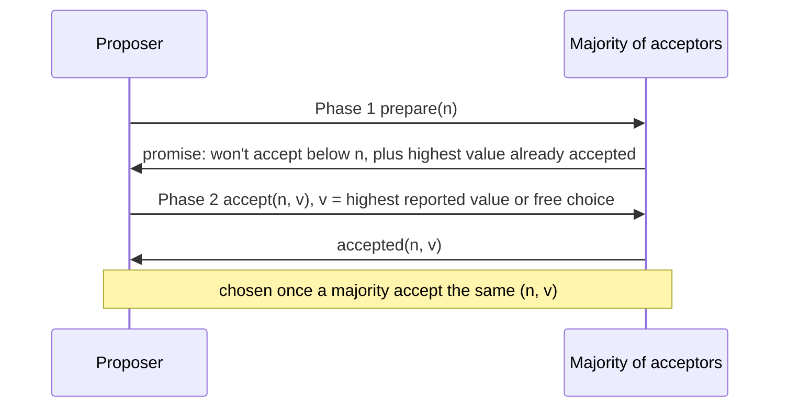

# 3. The Synod, and the safety trick

## The problem: multiple acceptances without two values

The previous chapter left a tension. For progress, acceptors must be able to accept more than one proposal over time. For safety, only one value may ever be chosen. Single-decree Paxos, the Synod protocol, is the rule that holds both at once, and Lamport's claim in "Paxos Made Simple" is that it "follows almost unavoidably from the properties we want it to satisfy." This chapter walks that derivation, because the derivation is the understanding.

First, give every proposal a number. A proposal is a pair, a number and a value, the numbers unique and totally ordered. These numbers are ballots, a way to tell one attempt from another and to say which attempt is later. They are not the values, and they are not clocks; nothing about wall-time or causal order is involved. Different proposers simply draw their numbers from disjoint sets, so no two proposers ever use the same number, and each proposer picks numbers higher than any it has used before.

## The one rule

Now the safety goal. We want: if a value v is chosen, then every higher-numbered proposal that gets chosen also has value v. If that holds, then by induction on the numbers, only one value is ever chosen. Lamport strengthens this step by step into a condition a proposer can actually enforce, and it comes down to a single rule:

Before a proposer proposes a value, it must make sure that if any value has already been chosen, the value it proposes is that one.

How can a proposer know what might already be chosen? It asks. It contacts a majority of acceptors and asks each for the highest-numbered proposal it has already accepted. Here the fact from the previous chapter does the work. If some value was already chosen, it was accepted by a majority, and the proposer's majority must intersect that one, so at least one acceptor in the proposer's majority has that value and reports it. The proposer then adopts the highest-numbered reported value as its own. It cannot propose a fresh value over a value that might already be chosen, because it is forced to carry the old one forward.

## The two phases

That single rule becomes a two-phase protocol.

In phase one, the proposer picks a number n and sends a prepare request to a majority. An acceptor that has not already answered a prepare with a higher number responds with two things: a promise never to accept any proposal numbered below n, and the highest-numbered proposal it has so far accepted, if any. The promise is the clever half. Rather than trying to predict what the acceptors might accept in the future, the proposer forecloses the future, extracting a commitment that they will not accept anything older than n.

In phase two, if a majority responded, the proposer sends an accept request for n with a value v, where v is the value of the highest-numbered proposal any of them reported, or, if none reported a proposal, any value the proposer likes. An acceptor accepts it unless, in the meantime, it has promised some higher number. A value is chosen the moment a majority have accepted the same proposal.

The acceptor's whole memory is two facts: the highest-numbered proposal it has accepted, and the highest-numbered prepare it has promised. Both must survive a crash, so both live in stable storage; an acceptor writes its intended response down before sending it.

## Why nothing can go wrong

Put the pieces together and the safety property is airtight. Suppose the value v was chosen with number m, so a majority C accepted the proposal (m, v). Take any later proposer using a number n greater than m. To finish phase one it needs promises from a majority S, and S must intersect C, so some acceptor in the intersection accepted (m, v) and will report it. By induction, v is the highest-numbered value that could come back, so phase two forces this proposer to propose v as well. Every proposal issued after v is chosen is driven to the same value v, so no proposal can carry a different value and no majority can ever assemble behind one. Once v is chosen, it is chosen forever. Two different values being chosen is not merely unlikely; it is impossible, no matter how messages are delayed, lost, or duplicated, and no matter which processes crash.

One consequence surprises people, so it is worth stating plainly. The proposer's own value often does not win. If any value was already accepted, phase one hands the proposer that value and it must propose it. A proposer, even a leader, is not a dictator choosing the outcome; when a value is already in play, the proposer is a courier forced to carry it. That is not a flaw. It is exactly the mechanism that makes the choice stick.

> **Principle:** Let acceptors change their minds, but make every proposer first ask a majority what has already been accepted and adopt the highest-numbered answer. Because its majority intersects any earlier one, a proposer cannot miss a value that might already be chosen, so once a value is chosen it can never be unchosen. Safety is a theorem, not a timing assumption.
