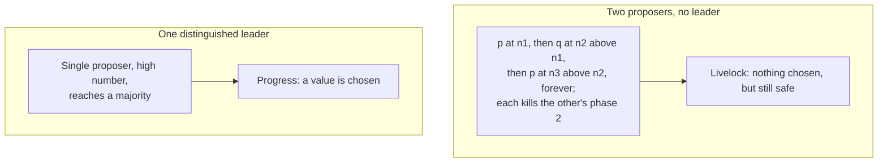

# 4. Safety always, liveness sometimes

## The problem: proven safe, but does it finish?

The previous chapter proved that Paxos never chooses two different values, through any delays, losses, and crashes. That is a strong guarantee, and it is only half of what you want. A protocol that is perfectly safe and never chooses anything is safe and useless. So the question is whether Paxos also makes progress, and the honest answer, the one this chapter is about, is: not always, and not by accident.

Lamport shows the trouble with a scenario anyone can reconstruct. Two proposers, no coordination. Proposer p finishes phase one with number n1. Then proposer q finishes phase one with a higher number n2, so the acceptors have now promised not to accept anything below n2, and p's phase-two accept requests are rejected. Stung, p starts over with an even higher n3 and finishes phase one, which causes q's phase-two requests to be rejected. Now q climbs to n4, and so on, forever. The two proposers leapfrog each other's numbers, each invalidating the other's second phase, and no value is ever chosen. This is a livelock, and note what it is not: it is never a safety violation. Throughout the sad dance, the invariants of the previous chapter hold perfectly. The system agrees on nothing, but it never disagrees.

## The fix, and its limit

The way out is obvious and its limit is the point. Elect a single distinguished proposer, a leader, and let it be the only one that issues proposals. With just one proposer, there is no one to duel with; it picks a high enough number, reaches a majority, and its value is chosen. Progress restored.

But now look hard at "elect a single leader." Electing one leader reliably is itself a consensus problem, in the same asynchronous world, and it runs into the same wall. Lamport names the wall directly: "The famous result of Fischer, Lynch, and Patterson [sic] implies that a reliable algorithm for electing a proposer must use either randomness or real time, for example, by using timeouts. However, safety is ensured regardless of the success or failure of the election."

Read that twice, because it is the sentence the reputation of Paxos should rest on. Safety is unconditional. Liveness is conditional, and the condition is that you can reliably pick one leader, which pure asynchrony cannot promise.

## Why Paxos does not beat FLP

The Fischer, Lynch, and Paterson result, from 1985, is the impossibility the fourth seminar set up. In a fully asynchronous system, where messages can be delayed without bound, no deterministic algorithm can guarantee that consensus is reached in every execution if even one process may crash. The reason is exactly the indistinguishability from the first chapter: a process cannot tell a crashed peer from a slow one, so any algorithm that waits can be made to wait forever, and any algorithm that stops waiting can be made to decide wrongly. Consensus cannot be both always-safe and always-live in that model.

Paxos does not escape this, and it is important to say so plainly, because "Paxos solves consensus" is the most common thing said about it and the most misleading. Paxos chooses which half to keep unconditionally. It keeps safety, always, no matter how adversarial the timing. It gives up guaranteed liveness, accepting that in a bad enough spell, dueling proposers, a flapping leader, a network that delays messages past every timeout, it may make no progress at all. What it promises is that whenever the system is well behaved for long enough, a stable leader that can reach a majority with timely messages, it does make progress. This is the standard resolution of FLP in practice, sometimes called partial synchrony: assume the network is chaotic sometimes and orderly eventually, keep safety through the chaos, and get liveness during the calm.

## What this costs in real systems

This is not an academic footnote; it is where most of the engineering goes. Because safety is free but liveness needs a stable leader, real consensus systems pour effort into leader election and failure detection, and they do it with the exact ingredients Lamport named: real time and randomness. They use timeouts to decide a leader is probably dead, leader leases to keep two nodes from both acting as leader for too long, and, as Raft made famous, randomized election timeouts so that competing candidates do not duel forever but instead break symmetry and settle on one. All of that machinery exists to manufacture the "stable leader" that the safety core assumes and cannot itself guarantee. The theorem in the last chapter needed no timing assumptions. The progress this chapter needs is entirely a timing bet, and a system's reliability in practice is mostly the quality of that bet.

> **Principle:** Consensus cannot be both always-safe and always-live in a fully asynchronous system, so Paxos refuses to compromise safety and treats liveness as a timing bet. Agreement is a theorem that holds through any chaos; progress is a hope that pays off whenever a single leader can reach a majority in time. An algorithm that claims both unconditionally is claiming to beat an impossibility.
