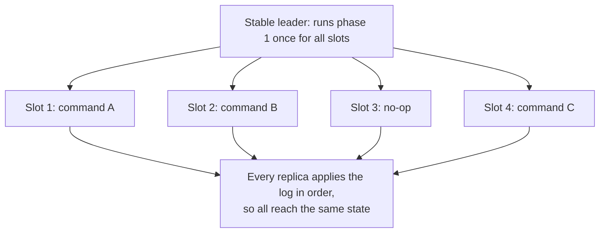

# 5. From one value to a log

## The problem: one value is not a system

Everything so far agrees on a single value. That is the Synod, and by itself it runs nothing. A real service is a stream of operations, deposits and withdrawals, puts and gets, and its replicas must agree not on one value but on the entire ordered sequence of them. The bridge from one value to a working system is the state-machine approach, the idea from Lamport's 1978 work that the fourth seminar covered: model the service as a deterministic state machine, and if every replica applies the same commands in the same order, every replica stays in the same state. The only hard part left is agreeing on the order, and agreeing on the order is just consensus, run over and over.

So the construction is direct. To agree on a log, run a separate instance of Paxos for each position in the log. The value chosen by instance one is the first command, the value chosen by instance two is the second, and so on. Each server plays all three roles in every instance. The single-decree safety proof, applied per slot, guarantees that no two servers ever disagree about the command in a given position, which is the consistency the replicated state machine needs.

## Multi-Paxos: one leader, phase one once

Running full single-decree Paxos independently for every command would be correct and slow, two round trips of messages for every operation, a prepare phase and an accept phase each time. Multi-Paxos is the optimization that makes it practical, and it rests on the observation from the Synod that the value in a proposal is not fixed until phase two. That means phase one, the prepare, does not depend on the value at all; it only establishes a proposer's right to propose. So you can do it in bulk and in advance.

Elect one stable leader to be the distinguished proposer for every instance at once. The moment it is elected, it runs phase one a single time, with one proposal number, for all instances, present and future, in one short message. From then on, in steady state, each new client command costs only phase two: the leader assigns the command the next open slot and sends one round of accept requests. One leader, one round trip per command, is the normal operating cost of a Paxos-based system, and it is why the paper can say phase two alone has essentially the minimum possible cost of fault-tolerant agreement.

## Gaps, no-ops, and moving parts

The log is where the messiness lives, and it is worth seeing a little of it, because it is where the gap between the idea and a real system opens up. When a leader fails and a new one takes over, the new leader may know the commands in some slots and not others, say it knows slots one through 134 and slots 138 and 139, but not 135 through 137. It runs phase one for the gaps and for everything beyond, learns whatever was already accepted, and for slots that turn out to be genuinely empty it proposes a special no-op command that changes nothing, purely so the log has no holes and can be executed in order. To go faster, a leader can work several slots ahead, proposing command i+1 before it has heard that command i was chosen, which trades a possible short gap on failure for pipelining. And the set of servers itself can change over time, handled elegantly by making the membership part of the replicated state, so a reconfiguration is just another command in the log.

Two things are worth holding onto here. First, keep single-decree Paxos and Multi-Paxos distinct: the safety core is the per-slot Synod from the third chapter, unchanged, and Multi-Paxos is that core plus a stable leader plus the phase-one-once optimization plus the log bookkeeping. Multiple servers believing they are leader is still perfectly safe, it only costs progress, just as the fourth chapter said; the leader exists for liveness, not correctness. Second, notice how compressed this all is. "Paxos Made Simple" describes the entire state-machine construction in a few pages, and every one of those moving parts, leader election, gap filling, snapshotting a growing log, reconfiguration, catching a lagging replica up, has to be built and made correct in a real system. The paper gives the algorithm; it does not give the system. That distance between the elegant core and the correct implementation is the subject the last chapters return to, and it is the reason Paxos earned its second reputation, as the algorithm everyone cites and few implement without pain.

> **Principle:** Agree on a log by running consensus once per slot, and make the steady state cheap by electing one stable leader that runs phase one a single time and thereafter needs only phase two. The safety core is unchanged single-decree Paxos; the leader, the log bookkeeping, and the gap filling are where a clean idea turns into a hard system.
