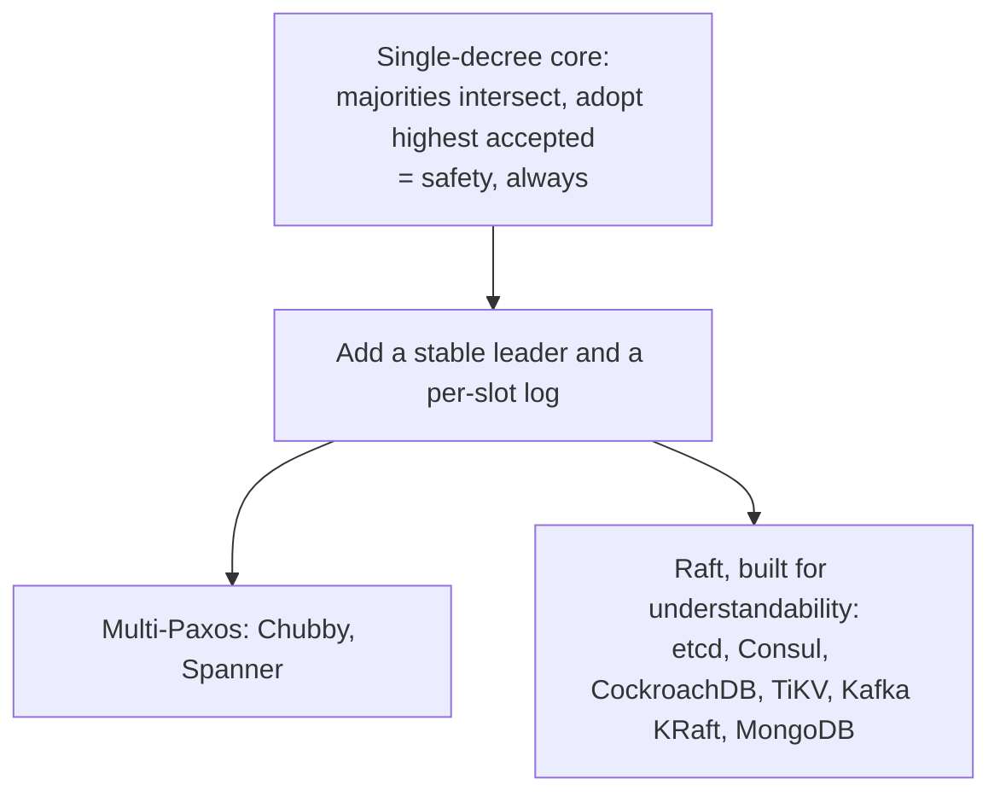

# 7. Modern echoes

Paxos is not a historical curiosity; it is the agreement engine inside a large fraction of the infrastructure running right now. This chapter maps where it lives, and it keeps one distinction throughout: what follows the single-decree safety core unchanged, and what is the log-and-leader machinery of the fifth chapter layered on top.

## Chubby, and the proof that the paper is not the system

Google's Chubby, the lock and small-file service that much of Google coordinates through, is built on Multi-Paxos: a stable leader replicating a log across a handful of replicas, the fifth chapter's construction. What makes Chubby important for reading Paxos honestly is the paper its builders wrote afterward, "Paxos Made Live," in 2007. It is a catalogue of everything the algorithm does not tell you: that the published protocol is a starting point, not a blueprint; that a real system has to handle disk corruption, master leases, group membership changes, and log compaction; that they found bugs in their own carefully derived implementation and had to invent a testing regime to trust it. It is the empirical proof of the sixth chapter's warning. The elegant core is small; the correct system around it is large, and the distance between them is where teams get hurt. This is the single best evidence that Paxos is not the clean end of the story.

## Spanner, ZooKeeper, and the family

Google's Spanner extends the idea to a globally distributed database. Each shard of data is replicated by its own Paxos group, a Multi-Paxos log keeping the shard's replicas identical, which is Paxos doing the job of this seminar. What Spanner adds is orthogonal to Paxos: TrueTime, a clock service with bounded uncertainty, used to order transactions across shards. It is worth being precise here, because it is easy to blur, Paxos provides agreement within a shard, and TrueTime, not Paxos, provides the cross-shard ordering. They are two mechanisms solving two problems.

ZooKeeper, the coordination service behind a generation of Hadoop-era systems, runs a protocol called Zab, ZooKeeper Atomic Broadcast. It is in the Paxos family, a leader-based protocol replicating an ordered log, but it is not Paxos; it is tuned to guarantee that updates from a given leader are delivered in order, a property ZooKeeper's programming model needs. It is a useful reminder that "consensus system" spans a family of related protocols, not a single algorithm.

## Raft, the understandable one that won

The most consequential echo is a reaction to the sixth chapter's problem. In 2014 Diego Ongaro and John Ousterhout published Raft, whose paper is titled, pointedly, "In Search of an Understandable Consensus Algorithm." Raft provides the same thing Multi-Paxos does, a replicated log built on a stable leader, but it was designed from the start to be teachable: a strong leader that all writes flow through, an explicit leader election using randomized timeouts to break the dueling-proposer symmetry the fourth chapter described, and a log structure that a person can hold in their head. It is not a different theory; underneath, it relies on the same majority-intersection safety and the same conditional, leader-based liveness. What it changed was legibility, and legibility won. The list of systems built on Raft is the list of the modern data infrastructure: etcd, which stores the state of every Kubernetes cluster; Consul; CockroachDB; TiKV; Kafka's KRaft mode, which replaced its own dependency on ZooKeeper; and MongoDB's replication. When a new system needs consensus today, it almost always reaches for Raft, precisely because Paxos was so hard to get right.

## The log is the primitive, and the variants

Step back and the pattern is that consensus is rarely the product; it is the primitive. Agree on an ordered log, apply it to a deterministic state machine, and you can build almost any coordination service: leader election, distributed locks, configuration and metadata stores, service discovery. etcd holding Kubernetes state, Consul doing service discovery, ZooKeeper storing the metadata of a dozen other systems, all are the replicated log of this seminar wearing an application's clothes. And the core keeps being retuned: Multi-Paxos adds the leader and the log; Fast Paxos trades larger quorums for fewer message delays; Egalitarian Paxos drops the single leader so that commands that do not conflict can commit in one round. Every one of them descends from the single-decree core, quorum intersection plus adopt-the-highest-accepted, and differs only in how it arranges the leader, the quorums, and the log.

All of it shares one more assumption, and naming it sets up the next seminar. Every protocol here tolerates crashes but trusts that no participant lies. When a replica speaks, others believe it is telling the truth about what it accepted. The moment you drop that assumption, and allow a participant to be actively malicious, sending one story to one peer and a different story to another, the problem changes shape and needs more replicas and more rounds. That is Byzantine fault tolerance, and Castro and Liskov's answer to it is where the series goes next.

> **Principle:** Consensus is the primitive, not the product: agree on a log, apply it to a state machine, and you have locks, leader election, configuration, and metadata. Everything from Chubby to Raft is the single-decree core plus a leader and a log, and the reason Raft exists at all is that the core was correct long before it was clear.
