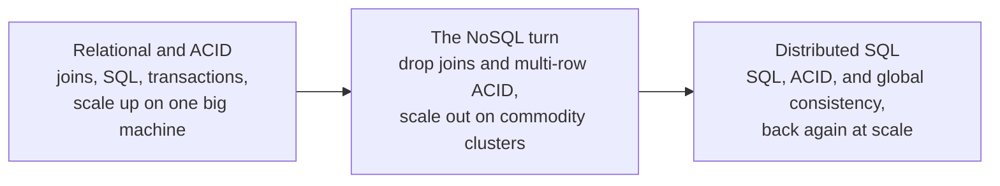

# 1. The arc and the pendulum

## The problem: data that outgrew the machine

By the early 2000s Google had a problem that no product you could buy would solve. It was crawling and indexing the entire web, which meant storing and processing data measured in petabytes, and it was doing it on tens of thousands of cheap commodity machines, the kind that fail every day. The database industry's answer to "more data" was to scale up: buy a bigger, more reliable machine, run a relational database on it, and trust decades of engineering to keep your joins fast and your transactions safe. That answer did not reach. There was no machine big enough, no single box whose failure Google could afford, and the distributed relational databases of the era could not shard and replicate across thousands of unreliable nodes at anything like an acceptable cost. Google had to build its own data infrastructure, and it had to assume the hardware underneath was always partly broken.

What makes this a seminar rather than a product tour is that the same lab, with Jeffrey Dean and Sanjay Ghemawat recurring at the center of it, answered the question three times over a decade, and the three answers disagree with each other. Reading them in sequence is like watching a field argue with itself and win both sides.

## The pendulum

Here is the shape of the argument, and it is the thing to hold in your head for the rest of the seminar.

MapReduce, in 2004, makes a move about computation: restrict the programming model to two functions, map and reduce, and in exchange the framework can take over everything hard about running across a thousand machines, including recovering from failure. Bigtable, in 2006, makes a move about storage that breaks with the entire relational tradition: give up joins, give up SQL, give up transactions that span more than one row, and in exchange you can spread a single enormous sorted map across thousands of servers. That is the turn the industry later branded NoSQL, and its tradeoffs were not a mistake; they bought scale that a 2006 relational database genuinely could not deliver. Then Spanner, in 2012, swings the pendulum back. It offers SQL, general ACID transactions, and consistency across datacenters on opposite sides of the planet, and it gets there not by forgetting the NoSQL lessons but by standing on a decade of new infrastructure.

## What the pendulum swings on

The reason Spanner can reclaim what Bigtable gave up is that the intervening years, and the earlier seminars in this book, built the parts. This is the convergence seminar, and Spanner is where the threads meet. Its transactions are the two-phase commit of the transaction seminar. The participants in that commit are each replicated by Paxos from the consensus seminar, which is the same crash-fault-tolerant replication the Viewstamped Replication seminar reached from another direction. Its global ordering comes from synchronized physical clocks, the half of Lamport's earliest seminar that logical clocks usually overshadow. Its query language descends from Codd's relational model. And Bigtable's coordination service, the one that decides which server is in charge, is Paxos running in production. None of these was invented here. They were composed here.

One caution before the tour, because it is the trap the seminar has to avoid. Dean and Ghemawat are the through-line, co-authors on all four papers, but they did not personally write all of them. Bigtable is Fay Chang and colleagues; Spanner is James Corbett and colleagues. These are large-team systems papers, and the credit belongs to the teams. Treat Dean and Ghemawat as the recurring names in a lineage, not as the sole authors of everything Google built.

> **Principle:** Scale is always bought by giving something up. The mark of a mature system is not refusing that trade but knowing exactly what it surrendered, so that when the ground shifts it can buy the lost thing back. This arc is one team surrendering the relational model for scale, then, a decade later, reclaiming it.
