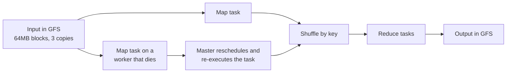

# 2. MapReduce: fault tolerance by re-execution

## The problem: every big job re-solved the same hard problems

Before MapReduce, running a computation over the whole web meant writing a distributed program by hand, and the actual logic, count the words, invert the index, was the easy part. The hard part was everything around it: split the input across machines, schedule the work, move intermediate data between nodes, balance load, and, unavoidably, cope with the machines that die partway through. On thousands of commodity boxes, something always dies partway through. Google's engineers found themselves solving those same distributed-systems problems again for every new analysis, and getting them subtly wrong each time.

The obvious fix, a library of distributed primitives, does not really help, because the failure handling is entangled with the application logic. If your program manages its own partial results and a machine vanishes, only your program knows how to recover, so the recovery code has to be rewritten every time. What was needed was a way to separate the computation from the coordination completely.

## The move: restrict the model, inherit the framework

MapReduce's insight is that a drastic restriction buys total control. The user writes just two functions, borrowed in spirit from functional programming: a map that turns each input record into intermediate key/value pairs, and a reduce that combines all the values for a given key. That is the entire programming interface. Because those functions are deterministic and free of side effects, the framework is free to run them however it likes, and it takes over everything else. As the paper puts it, "our use of a functional model with user-specified map and reduce operations allows us to parallelize large computations easily and to use re-execution as the primary mechanism for fault tolerance."

Re-execution is the key mechanism, and it is almost anticlimactic, which is the point. The master pings every worker. If a worker stops answering, the master marks it dead and simply reschedules its tasks onto other machines. A completed map task on the dead machine has to be re-run, because its output was sitting on that machine's local disk and is now gone; a completed reduce task does not, because its output was already written to GFS, the shared file system. The framework does not try to repair a failed computation. It throws the piece away and runs it again.

This works only because the pieces are deterministic. When the map and reduce operators are deterministic functions of their input, the paper notes, the distributed run "produces the same output as would have been produced by a non-faulting sequential execution of the entire program." Duplicate runs are made harmless by committing outputs atomically: a reduce task writes to a temporary file and atomically renames it into place, so if two copies of the same task finish, the file system guarantees only one result survives. Determinism plus atomic commit is what makes re-execution safe rather than corrupting.

The same property enables the other famous trick, backup tasks. Near the end of a job, a few slow machines, stragglers with a failing disk or a misconfigured cache, can hold up the whole computation. So the master proactively launches backup copies of the last few in-progress tasks and takes whichever finishes first. It is re-execution used pre-emptively against slowness rather than reactively against failure, and it matters: with backup tasks disabled, the paper reports a sort job taking 44 percent longer.

Underneath sits the Google File System, which made the same bet about the world. Its opening premise is that "component failures are the norm rather than the exception," so it stores huge files as 64MB chunks replicated across commodity machines, and MapReduce leans on that by scheduling each map task near a copy of its input so most data is read from a local disk. Storage and computation were co-designed to assume the hardware is always partly broken.

## What it is not

Two clarifications, because both are routinely muddled. MapReduce is a batch programming model, not a database and not an interactive query engine; it grinds through enormous inputs and writes enormous outputs, and it is not built to answer a question in milliseconds. And MapReduce is not Hadoop. Hadoop is the open-source reimplementation of these ideas that grew up outside Google, and while it made the model available to everyone, it is a separate system. The contribution here is also not the invention of parallel computing; map and reduce are old ideas from functional languages. The contribution is the restricted model that let a framework hide distribution and failure at Google's scale.

There is an echo of an earlier seminar here. Armstrong's answer to a broken process was to let it crash and restart it clean rather than repair it in place. MapReduce's answer to a broken task is the same: do not diagnose it, re-execute it. The unit of recovery is the deterministic task, and because it is deterministic, restarting it is free of consequences. Failure is not prevented; it is made boring.

The lineage from here is the modern batch and streaming stack. Hadoop MapReduce carried the model into the wider world, and then Spark largely superseded rigid map-then-reduce for iterative and interactive work by keeping data in memory and letting programs express a whole graph of operators rather than a single map followed by a single reduce. Flink and Beam extended the same spirit to unbounded streams. All of them keep the core bargain: the programmer describes the computation, the framework owns the failures.

> **Principle:** Restrict the programming model enough and the framework can make failure invisible, because a deterministic unit of work can always be thrown away and run again. The cost is honest: not every computation fits into two functions, which is why the model's successors had to widen it.
