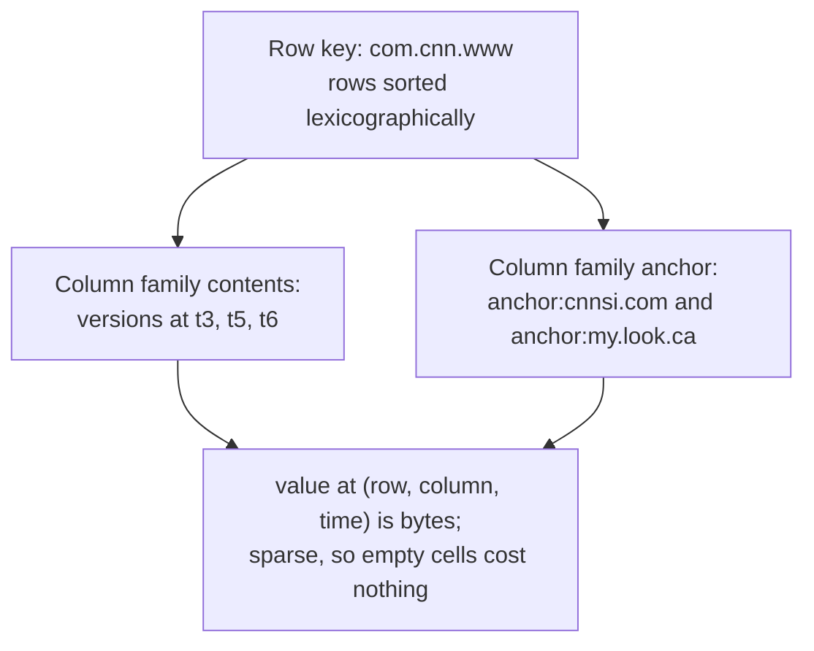

# 3. Bigtable: the sparse sorted map

## The problem: online structured storage at web scale

MapReduce grinds through data in batches. Google also needed the opposite: online storage for structured data that could serve random reads and writes with low latency and stay up, across the web index, Google Earth, Google Analytics, and dozens of other products, at petabyte scale on commodity hardware. The natural tool for structured data is a relational database. It was the wrong tool here, and understanding why is understanding the NoSQL turn.

A relational database earns its keep with joins, a declarative SQL query language, and ACID transactions across arbitrary rows. Every one of those is what resists scaling out. A join may touch data on many machines; a transaction across arbitrary rows may need to lock and coordinate across many machines; and the relational model deliberately hides the physical layout of data, which is elegant until you are the one who needs to control which bytes sit next to which other bytes on which disk. At Google's volume, the features that make a relational database pleasant were the features that made it impossible.

## The move: not a database, a sorted map

Bigtable's answer is to stop trying to be a database. The paper is blunt that it "does not support a full relational data model." What it offers instead is stated in one precise sentence: "A Bigtable is a sparse, distributed, persistent multi-dimensional sorted map. The map is indexed by a row key, column key, and a timestamp; each value in the map is an uninterpreted array of bytes." That is the whole data model. A key is a triple, and a value is bytes Bigtable never interprets.

Each piece of that definition is load-bearing. Sorted means rows are kept in lexicographic order, which hands clients the locality control the relational model took away: Google stores web pages under reversed-domain keys like com.cnn.www so that pages from one site land next to each other and scan together. Sparse means a row can have any subset of columns and the empties cost nothing, so a table with millions of possible columns is cheap. Multi-dimensional means each cell can hold multiple timestamped versions, so history is built in. Columns are grouped into families that share storage and access control. It is a data structure, not a schema, and clients reason about it as one.

What you surrender is everything relational. Bigtable "supports single-row transactions, which can be used to perform atomic read-modify-write sequences on data stored under a single row key," and then stops: it "does not currently support general transactions across row keys." One row is the atomic unit. No joins, no SQL, no multi-row transactions. This is the real content of the NoSQL trade, and it is best described in the paper's own terms rather than the marketing category that came later. The point was never that SQL is bad. The point was that dropping it let a single map shard across thousands of machines.

## The engine that made it cheap

The reason a sorted map scales is the storage engine underneath, and it has since taken over the industry. Bigtable stores data in SSTables, described as a "persistent, ordered immutable map from keys to values." Immutable is the magic word. Writes do not modify files in place; they go to an in-memory structure and a commit log, and are periodically flushed to new immutable SSTables, which are later merged by background compaction. Reads merge the in-memory recent writes with the on-disk sorted files. Because every file is sorted and immutable, writes are sequential and cheap, and merging sorted files is easy. This design, an in-memory table plus immutable sorted files plus compaction, is a log-structured merge tree. The LSM-tree idea was named by O'Neil and colleagues in 1996, so Bigtable did not invent it, but Bigtable popularized it as the storage engine for scale, and today it is everywhere.

A table is split into tablets, contiguous ranges of rows, and each tablet is served by a tablet server, with a master assigning tablets to servers. That raises an obvious question, one every distributed system must answer: who decides which server owns what, and how does anyone find the master when servers keep dying? Bigtable does not answer it itself. It hands the problem to a separate service, which is the subject of the next chapter and one of the clearest cases of an earlier seminar showing up in production.

There is a pointed reversal of Codd here. Codd's relational model made physical data independence a virtue: the programmer should not know or care how data is laid out. Bigtable makes physical layout a feature the client controls on purpose. That is not Codd being wrong; it is a different point on the same design axis, chosen because at this scale locality is a resource too precious to hide.

The open-source world followed immediately. HBase is an open reimplementation of Bigtable on top of Hadoop's file system. Cassandra fused Bigtable's data model with Amazon Dynamo's replication. And the LSM engine spread far beyond wide-column stores, into LevelDB and RocksDB, which now sit inside databases of every shape.

> **Principle:** Give up the join and the cross-row transaction and a sorted map will shard across thousands of machines. The relational model's physical independence is a genuine luxury, and scale is what you pay for it, until someone figures out how to buy it back.
