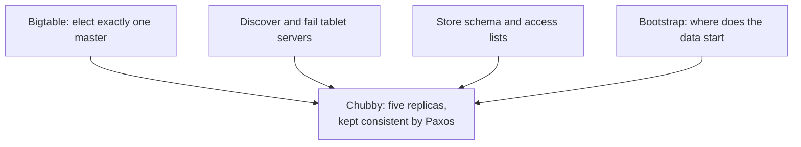

# 4. Chubby: Paxos in production

## The problem: everyone needs to agree on one thing

The previous chapter ended on a question Bigtable refused to answer itself: who decides which tablet server owns which tablet, how does the system ensure there is exactly one master, and how does anyone find that master when servers keep dying? These are not storage questions. They are agreement questions, the consensus problem of the Lamport seminar, and they recur in every distributed system Google runs. GFS needs to know its master. MapReduce needs to track workers. Bigtable needs a single master and a live map of its servers.

The tempting answers are all quietly broken. A static config file naming the master cannot survive that master failing. A homegrown heartbeat that promotes a backup will, under a network partition, promote a second master while the first still thinks it is in charge, and now two masters issue conflicting decisions to the same data. That is split brain, and it corrupts. The correct fix is real consensus, but the consensus seminar spent a chapter on how hard Paxos is to implement correctly, and the last thing you want is every system at Google embedding its own subtly wrong Paxos.

## The move: solve consensus once, sell it as a lock

Chubby is the decision to solve consensus exactly once, put it behind a dead-simple interface, and make everything else depend on it. The paper describes it as "a highly-available and persistent distributed lock service," and the mechanism is stated plainly: "A Chubby service consists of five active replicas, one of which is elected to be the master and actively serve requests. The service is live when a majority of the replicas are running and can communicate with each other. Chubby uses the Paxos algorithm to keep its replicas consistent in the face of failure." Five replicas, a majority quorum, Paxos underneath: this is the single-decree safety and the majority intersection of the consensus seminar, running as a product.

What Chubby exposes on top is deliberately humble: a namespace of directories and small files, where any file can act as a lock and reads and writes are atomic, plus sessions with leases so that a client that vanishes loses its locks. No application has to think about ballots or quorums. It grabs a lock or reads a small file.

Bigtable leans on Chubby for the jobs that need agreement. It uses Chubby "to ensure that there is at most one active master at any time," which is the split-brain problem solved by consensus rather than hope; to store the bootstrap location of the data; to discover tablet servers and to finalize their deaths; to hold schema information; and to store access control lists. The dependency is real and the paper is honest about its cost: "if Chubby becomes unavailable for an extended period of time, Bigtable becomes unavailable." They measured it, and the average Bigtable unavailability caused by Chubby was 0.0047 percent, a number you only publish if you have concentrated the risk deliberately and watched it closely.

## Why concentrate the risk

That concentration is the whole idea. Consensus is the most expensive and most error-prone thing a distributed system does, so you do not scatter it across a dozen systems, each with its own bugs. You build it once, staff it with the people who understand it, and let everyone else depend on a lock. This is also the literal origin of the consensus seminar's cautionary tale: the account of how hard real Paxos is to build, "Paxos Made Live," is Google's write-up of building Chubby. The theory became a product, and the product taught the theorists how much the paper had left out.

The pattern outlived Chubby and became infrastructure everyone uses. ZooKeeper is the open-source coordination service that a generation of systems, including early Kafka and HBase, leaned on the way Bigtable leaned on Chubby. etcd, built on Raft, is the coordination service that stores the state of every Kubernetes cluster. When a modern system needs a leader elected or a configuration agreed, it almost never implements consensus itself. It calls one of Chubby's descendants, which is the move Bigtable made in 2006.

> **Principle:** Consensus is expensive and easy to get wrong, so do not spread it, concentrate it. Build agreement once into a service, expose it as a lock, and let the rest of the system depend on that single well-run thing rather than each reinventing the hardest algorithm in the field.
