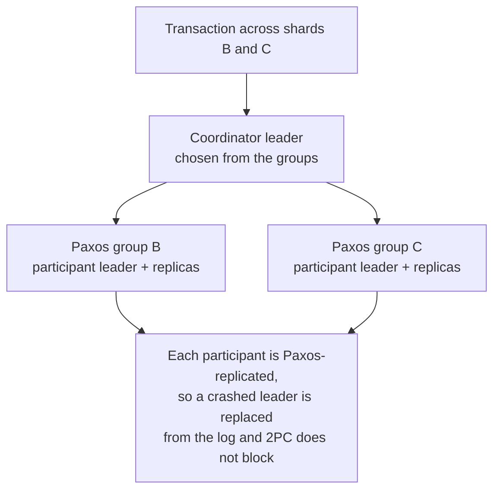

# 5. Spanner I: transactions over Paxos groups

## The problem: the NoSQL trade started to hurt

Bigtable's single-row atomicity was liberating for scale and painful for applications. Anything with a complex, evolving schema, or a genuine need to change several rows together and have them all commit or all fail, had to build transactions by hand on top of a store that did not offer them. Google's own advertising backend, F1, was such an application, and it wanted what Bigtable had thrown away: a schematized, SQL-queryable database with general transactions. The pendulum was ready to swing back. The question was how to bring back distributed ACID transactions without inheriting the reason everyone had abandoned them.

That reason has a name from the transaction seminar: two-phase commit blocks. In classic 2PC a coordinator asks every participant to prepare, and once they all vote yes it tells them to commit. If the coordinator crashes between those steps, the participants are stranded, holding locks, unable to commit safely because maybe someone voted no, and unable to abort safely because maybe everyone voted yes and some already committed. A single failure at the wrong moment freezes the transaction. Gray's seminar showed this fragility, and it is precisely why the industry ran from distributed transactions toward the looser guarantees of NoSQL.

## The move: make every participant a Paxos group

Spanner's structural insight is that 2PC is only fragile because its participants are single machines that can die and stay dead. So it makes each participant something that cannot stay dead. Spanner spreads its data across many Paxos groups, and each group replicates a slice of the database across datacenters, running a Paxos state machine with a long-lived elected leader that keeps its replicas identical. Data moves between groups a directory at a time, a directory being a set of keys that share a prefix. Now a "participant" in a transaction is not a machine; it is a replicated group.

Within a single Paxos group, a transaction needs no commit protocol at all, because, as the paper says, "the lock table and Paxos together provide transactionality." The interesting case is a transaction that spans groups. There, Spanner runs two-phase commit, but between groups rather than between machines: one group's leader acts as the coordinator leader and the others as participant leaders.

This is the convergence of two seminars in a single design, and it deserves saying slowly. Two-phase commit provides atomicity across shards: all commit or all abort. Paxos provides durability of each participant: if a coordinator or participant leader crashes, its group elects a new leader that recovers the transaction's state from the replicated log and carries the protocol to its conclusion. The failure that froze classic 2PC, the death of a participant, is now just a leader election inside a group, the routine event the consensus seminar handles. Gray's protocol supplies the shape, Paxos supplies the resilience, and the same crash-fault-tolerant replication that Viewstamped Replication reached independently is what each group runs. Neither piece is new. The composition is what makes distributed ACID transactions survivable.

## What is still missing

Replicating the participants makes a distributed transaction durable, but it does not by itself make transactions globally ordered. If two transactions touch different groups on different continents, what decides which one happened first, in a way every replica everywhere agrees on and that respects the order a user actually observed? Locks give you serializability within the set of things a transaction touches, but Spanner promises something stronger, external consistency: if one transaction finishes before another begins, even on the far side of the planet, their commit order must reflect that. To deliver that guarantee you need a shared, trustworthy notion of time, and inventing one on machines whose clocks all disagree is the subject of the next chapter. It is where the last thread, Lamport's physical clocks, enters.

The architecture in this chapter, distributed SQL transactions run as two-phase commit over consensus-replicated shards, is not a Google-only curiosity. It is the blueprint the systems that followed Spanner adopted directly. CockroachDB, YugabyteDB, and TiDB all layer transactions over Raft or Paxos groups in essentially this shape. The industry that fled distributed transactions in 2006 walked back to them once replication made them safe.

> **Principle:** Two-phase commit was fragile because a participant could die and stay dead. Replicate each participant with a consensus group and the same protocol becomes durable, because the death of a leader turns into a leader election rather than a stuck transaction. Composition, not reinvention, is what reclaimed distributed ACID.
