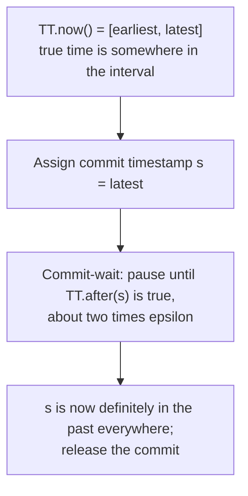

# 6. Spanner II: TrueTime and commit-wait

## The problem: whose clock decides the order?

Spanner promises external consistency: if transaction T1 commits before T2 begins, then across the planet T1's commit timestamp is smaller than T2's, so the order the database records matches the order the world observed. The paper equates this with linearizability, and it is the strongest ordering a distributed database can offer. To provide it, Spanner assigns each transaction a commit timestamp and orders transactions by those timestamps. Everything hinges on the timestamps being trustworthy, and that is where physics gets in the way.

The naive approach, stamp each transaction with the local machine's wall clock, fails for the reason Lamport's earliest seminar gave: there is no global "now." Clocks on different machines drift and disagree, sometimes by tens of milliseconds. If a transaction in one datacenter reads a clock that happens to run fast and another in a distant datacenter reads a clock that runs slow, the timestamps can order the two transactions backwards relative to real time, and external consistency breaks. Logical clocks, the famous half of that seminar, do not rescue you either: they capture causal order between related events, but they say nothing about the real-time order of two transactions that never communicate. What Spanner needs is real, physical, wall-clock order, made reliable across the globe.

## The move: expose the uncertainty, then wait it out

TrueTime's idea is to stop pretending clocks are exact and instead measure how inexact they are. Its central call, TT.now(), does not return a single instant. It returns an interval, "[earliest, latest]," that is "guaranteed to contain the absolute time during which TT.now() was invoked." The true time is somewhere inside; the width of the interval is the honest admission of uncertainty, and half that width is the error bound the paper calls epsilon. Google keeps epsilon small, generally under ten milliseconds, using two independent kinds of clock, GPS receivers and atomic clocks, backed by time-master machines in every datacenter and a daemon on every server that polls many masters and uses Marzullo's algorithm to reject the liars. The design uses two clock types on purpose, because GPS and atomic clocks fail in unrelated ways.

Exposing uncertainty is only half of it. The trick that turns a fuzzy interval into a hard guarantee is commit-wait, and it is two short rules. First, when a transaction is ready to commit, the coordinator assigns it a commit timestamp "no less than the value of TT.now().latest," the very latest time it could possibly be right now. Second, the coordinator "ensures that clients cannot see any data committed by Ti until TT.after(si) is true," meaning it deliberately waits until that timestamp is definitely in the past everywhere before releasing the result. The wait is about twice epsilon.

Sit with why that works. By waiting until its own timestamp is guaranteed past, a committing transaction ensures that any transaction which starts afterward will, when it reads its own clock, necessarily get a larger timestamp. So real-time order is preserved: commit before start implies smaller timestamp before larger timestamp, which is external consistency. Spanner does not need synchronized clocks. It needs bounded uncertainty and the willingness to pause for it.

## What TrueTime is and is not

This is the point most retellings get wrong, so it is worth stating flatly. TrueTime does not eliminate clock uncertainty, and it does not give Spanner perfectly synchronized clocks. It bounds the uncertainty, exposes it as an interval, and then pays for it by waiting. That payment is real: commit-wait adds latency, roughly twice epsilon, to every read-write transaction, which is why Google spent so much on GPS and atomic clocks. Every millisecond shaved off epsilon is a millisecond shaved off every commit. Certainty about time is bought with latency.

This is the industrial cash-out of the neglected half of Lamport's clocks seminar. That paper is remembered for logical clocks, but it also worked out how to synchronize physical clocks to within a bounded error. TrueTime is that idea built at datacenter scale, with the bound made explicit and handed to the application as an interval to reason about.

Two things not to conflate. Bigtable also has per-cell "timestamps," but those are version labels for storing history, not the globally meaningful commit timestamps Spanner reasons about; same word, different job. And the distributed-SQL systems that followed Spanner do not have its clock hardware. CockroachDB, YugabyteDB, and TiDB use hybrid logical clocks, a software scheme that combines physical and logical time with a much larger assumed uncertainty, and they cope with it differently, for example by restarting reads that fall inside the uncertainty window rather than by hardware-tight commit-wait. They were inspired by Spanner; they did not clone TrueTime, because they could not.

> **Principle:** You cannot make distributed clocks perfect, so do not pretend to. Measure how wrong they might be, expose that error as a bound, and wait it out when correctness depends on it. The uncertainty does not go away; it becomes a latency you choose to pay.
