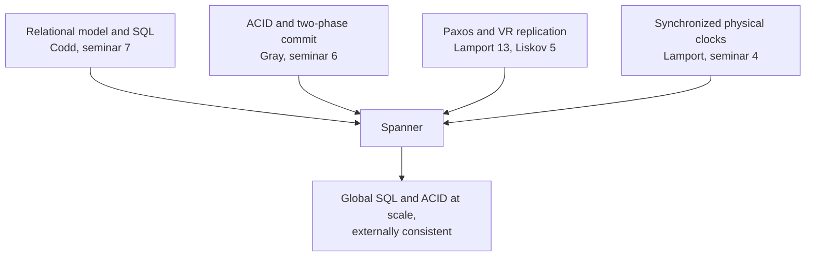

# 7. Convergence, and the CAP honesty

## The threads meet

Spanner is the seminar where the book's distributed-data threads stop running in parallel and tie together. Look at what it is made of. Its query language and schematized tables descend from Codd's relational model, the thing Bigtable had thrown overboard. Its cross-shard transactions are Gray's two-phase commit. The participants in that commit are replicated by Paxos, the consensus algorithm from the Lamport seminar, which is the same crash-fault-tolerant replication Liskov's Viewstamped Replication reached from the systems side. And its global ordering rests on synchronized physical clocks, the quiet half of Lamport's earliest seminar. Even one layer down, Bigtable's coordination runs on Chubby, which is Paxos in production. Spanner did not invent a new theory of distributed data. It composed five older ones.

That is the deeper lesson of the arc. The pendulum did not swing back because someone found a cleverer database. It swung back because the primitives underneath matured. In 2006 you could not run cross-datacenter transactions without them blocking, and you could not trust a timestamp from a distant machine. By 2012, consensus replication made the participants durable and bounded clocks made the timestamps meaningful, and suddenly the relational model and ACID were affordable again at scale. The classics were not superseded by the internet giants. They were waiting for the infrastructure to catch up so they could be assembled.

## Spanner does not beat CAP

Because Spanner offers SQL, ACID, and global consistency all at once, it is easy to reach for the exciting and wrong conclusion that it beat the CAP theorem. It did not, and Spanner's own community is careful about this. CAP says that when the network partitions, a system must choose between remaining consistent and remaining available. Spanner chooses consistency. Under a partition it is a CP system: the side that cannot reach a majority of a Paxos group stops serving rather than return data that might be inconsistent. Eric Brewer, who first stated CAP, wrote a note titled "Spanner, TrueTime and the CAP Theorem" saying exactly this, that Spanner is "technically a CP system."

What makes Spanner feel like it has it all is not a loophole in the theorem but an engineering fact about Google. Google runs its own global network with enough redundancy that genuine partitions between datacenters are rare, so the occasions on which Spanner must sacrifice availability almost never arrive, and its measured availability sits at five nines or better. That is a triumph of network engineering, not a repeal of a law. The honest sentence is: Spanner chooses consistency and is unavailable during partitions, but partitions are rare enough that you seldom notice. A system that claims to beat CAP is usually just hiding where it pays.

## The honest pendulum, and the lineage

It is equally important not to read the arc as "Google made a mistake with NoSQL and then corrected it." Bigtable's tradeoffs were the right call in 2006. Its simplicity enabled a scale that a relational database of that era genuinely could not reach, and countless systems ran happily on those tradeoffs. Spanner's return was not a correction; it was a reclamation that required something most organizations will never have, GPS receivers and atomic clocks in every datacenter and a decade of infrastructure to make bounded time real. The pendulum swings on resources and understanding, not on someone finally getting it right.

The whole arc seeded the data stack running underneath modern software.

| Google origin | Modern descendants |
|---|---|
| MapReduce (2004) | Hadoop, then Spark, Flink, Beam |
| GFS (2003) | HDFS, cloud object stores |
| Bigtable (2006) | HBase, Cassandra, RocksDB (LSM) |
| Chubby | ZooKeeper, etcd |
| Spanner (2012) | Cloud Spanner, CockroachDB, YugabyteDB, TiDB |

The right column is not just imitation. Spark widened MapReduce's rigid two-step model into a general operator graph held in memory. Cassandra fused Bigtable's data model with Dynamo's replication. The distributed-SQL systems rebuilt Spanner's transactions-over-consensus architecture with hybrid logical clocks in place of atomic ones. Each descendant kept the idea and adapted the mechanism to hardware it actually had.

> **Principle:** The classics were composed, not replaced. A globally consistent SQL database is Codd, Gray, Lamport, and Liskov assembled once the primitives matured, and it does not beat the CAP theorem: it chooses consistency and pays for availability elsewhere. When a system looks like it broke a law, find the bill.
