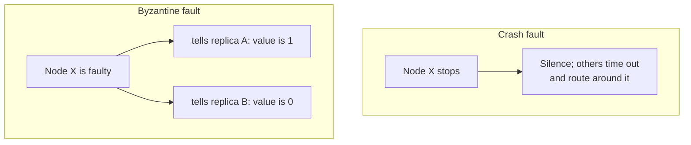

# 1. The assumption every protocol made

## The comfortable assumption

Stop and notice something the last several seminars shared. Viewstamped Replication, Paxos, and the systems built on them, Chubby and Spanner, all tolerate failure, and they all define failure the same way: a broken node fails by stopping. It goes silent. It might be slow, it might be unreachable, it might be permanently dead, but it never sends a wrong answer, and it certainly never sends one answer to one replica and a different answer to another. This is the crash-fault model, and it was a deliberate choice each of those protocols made and each of these seminars was careful to state.

Crash faults are comfortable because silence is honest. A node that has stopped is giving you accurate information by giving you nothing. You wait, you time out, you route around it, and the node that went quiet was not plotting against you while it did. This is also why crash tolerance is cheap. To survive f crashes you need 2f+1 replicas, so that any two majorities overlap in at least one node, and because the overlapping node cannot lie, one honest witness in the overlap is all you need to carry the truth across. The whole edifice of the last few seminars rests on that: the overlapping node tells the truth.

## When silence is not the failure

The trouble is that real systems fail in ways that are not silent. A software bug makes a replica compute the wrong result and report it with total confidence. A corrupted disk returns data that passes every check but is quietly wrong. A misconfigured or half-upgraded node behaves inconsistently. And in the worst case, which is increasingly the realistic case, an attacker compromises a machine and now controls what it says. None of these nodes stop. They keep participating, keep voting, keep answering, and everything they say might be false. Against that, a protocol that assumes failure means silence is not just imperfect. It is unprotected.

The general name for this is the Byzantine-fault model, and its definition is the absence of any definition: a faulty node may behave arbitrarily. It may send correct-looking messages that are wrong. It may follow the protocol perfectly toward one replica and violate it toward another. It may collude with the other faulty nodes, coordinating its lies for maximum damage. The one power that matters most, the one that breaks everything, is equivocation: a Byzantine node can tell replica A that the answer is one, and tell replica B, at the same moment, that the answer is zero.

## Why equivocation changes everything

Sit with why equivocation is fatal to the earlier protocols. Paxos's safety rested on quorum intersection: two quorums share a node, and that node remembers what it accepted and reports it honestly, so a later proposer cannot miss an earlier decision. Now suppose the shared node is Byzantine. It can tell the first quorum it accepted value one and tell the second quorum it accepted value zero, and both quorums proceed believing they hold the truth. The single honest witness that crash-tolerant consensus depended on has become a double agent, and the intersection argument collapses. One lying node in the wrong place can split the honest majority into two groups that each think they have agreed, on different things.

That is the problem Practical Byzantine Fault Tolerance solves, and it is why the rest of this seminar looks so different from the crash-tolerant protocols. To defeat a node that can lie to two sides at once, you will need more replicas, so that every quorum overlap contains not just one node but enough nodes to guarantee an honest one. You will need an extra round of messages, so that replicas can cross-check each other rather than trust a single source. And you will need cryptography, so that a faulty node cannot forge an honest node's words and impersonate the very witnesses you are counting on. Each of those costs traces directly back to equivocation.

> **Principle:** The failure model is a choice, not a fact of nature. A node that fails by going silent and a node that fails by lying are different adversaries, and a protocol proven correct against the first can be broken trivially by the second. Deciding which one you face is the first decision, because it determines every other one.
