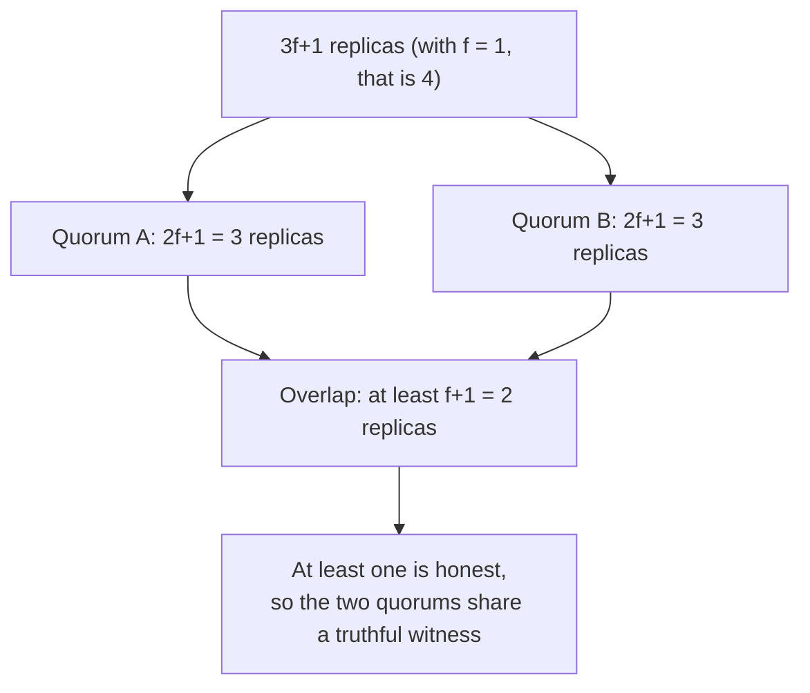

# 3. Why 3f+1

## The crash math, one more time

This is the chapter the seminar turns on, and it is a single change to a piece of arithmetic the book already knows. Recall the crash-tolerant math from Viewstamped Replication and Paxos. To survive f nodes failing by stopping, you use 2f+1 replicas. A quorum is a majority, f+1 of them, and the reason it works is that any two quorums overlap in at least one node. That overlapping node is the witness: it was in the quorum that made an earlier decision and it is in the quorum making the next one, so it carries the earlier decision forward. Crucially, in the crash model that witness tells the truth, because a crashed node is silent, not deceitful. One honest witness in the overlap is enough, and 2f+1 guarantees one.

Now put a Byzantine node where that witness stands. It can be in both quorums, and it can tell the first quorum it saw value one and the second quorum it saw value zero. The overlap still exists, but it no longer carries the truth, because the node in it is lying to each side. A single shared node is worthless if that node can equivocate. So the requirement has to change: the overlap between any two quorums must contain not just one node, but enough nodes that at least one of them is guaranteed honest.

## Outvoting the liars

How many is enough? Up to f nodes can be faulty, so if the overlap contains f+1 nodes, at least one of them must be honest no matter which f are the liars. Getting to that guarantee is what forces the jump from 2f+1 to 3f+1, and the paper's reasoning is worth quoting because it is the argument:

> It must be possible to proceed after communicating with n minus f replicas, since f replicas might be faulty and not responding. However, it is possible that the replicas that did not respond are not faulty and, therefore, f of those that responded might be faulty. Even so, there must still be enough responses that those from non-faulty replicas outnumber those from faulty ones.

Follow it in three steps. You cannot wait for all n replicas, because f of them might be faulty and silent, so a quorum can be at most n minus f. But among the n minus f that do answer, as many as f might be faulty and lying. For the honest answers to outnumber the lying ones, you need (n minus f) minus f to exceed f, that is n minus 2f greater than f, which gives n greater than 3f. So n must be at least 3f+1, and the quorum size is n minus f, which is 2f+1.

Check it against the geometry. Two quorums of 2f+1 drawn from 3f+1 replicas must overlap in at least 2(2f+1) minus (3f+1), which is f+1 nodes, and f+1 nodes cannot all be faulty when at most f are. So every pair of quorums shares at least one honest replica. That honest replica is the incorruptible witness the crash protocols got for free and the Byzantine protocol has to pay for.

## The whole difference on one page

The contrast with the crash-tolerant seminars is the single most important thing to carry out of this chapter, and it fits in a small table.

| Property | Crash (VR, Paxos) | Byzantine (PBFT) |
|---|---|---|
| Replicas for f faults | 2f+1 | 3f+1 |
| Quorum size | f+1 | 2f+1 |
| Overlap contains | one live node | one honest node |
| Rounds of agreement | two | three |
| Cryptography | optional | required |

Every row is downstream of one idea. Because a faulty node can lie rather than merely stop, a quorum overlap has to survive the liars inside it, and that alone raises the replica count from 2f+1 to 3f+1 and the quorum from a bare majority to 2f+1. The extra round and the cryptography in the last two rows are the next two chapters, and they exist for the same reason: to make sure that the honest witness the math promises can actually be heard over the noise the liars make.

> **Principle:** With crashes you need one live witness in every quorum overlap; with lies you need one honest witness, and guaranteeing an honest one means the overlap must outnumber the liars it might contain. That single requirement, honest majority in the overlap, is the whole reason Byzantine tolerance costs 3f+1 instead of 2f+1.
