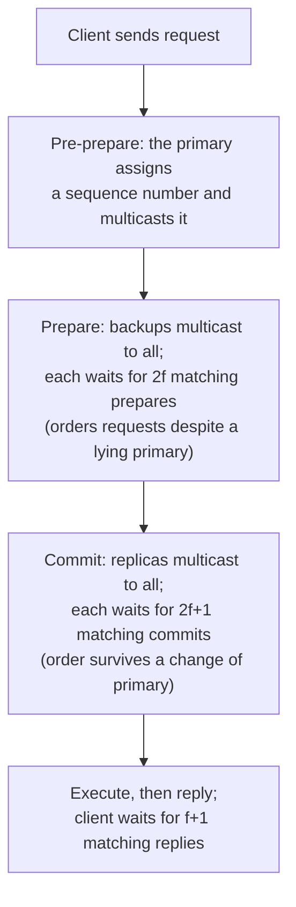

# 4. The three-phase protocol

## The problem: agree on an order when the proposer might lie

The replica count guarantees an honest witness in every quorum overlap. Now the replicas have to use that to do the actual job: agree on a single total order in which to execute client requests, so that all the honest replicas stay identical. This is state-machine replication, the idea from the fourth seminar, and PBFT builds it the same way Viewstamped Replication and Paxos did, which the paper cites directly. One replica is the primary and proposes the order; the others are backups. The service is deterministic and starts in the same state, so if every honest replica executes the same requests in the same order, they all agree.

The question is how to fix that order when the primary itself might be Byzantine. Paxos needed only two phases, a leader proposing and a quorum accepting, because a crash-model leader can be slow or dead but never dishonest. A Byzantine primary is a different animal. It can assign sequence number 5 to request A when it talks to one backup, and assign sequence number 5 to a different request B when it talks to another. It equivocates about the very ordering it is supposed to establish. Two phases cannot catch that, because the backups never compare notes; each just hears the primary and trusts it. PBFT adds a phase precisely so the backups can check each other instead of trusting the source.

## Pre-prepare, prepare, commit

In the pre-prepare phase, the primary picks a sequence number for a request and multicasts a signed pre-prepare message announcing that assignment. This is the proposal, and by itself it is worth nothing, because the primary might be lying.

In the prepare phase, every backup that accepts the pre-prepare multicasts a prepare message to all the other replicas. A replica considers the request prepared once it holds the pre-prepare plus 2f matching prepares from different backups. Count those: the primary's pre-prepare plus 2f prepares is 2f+1 replicas that all agree this request has this sequence number in this view. Because any two such sets of 2f+1 share an honest replica, and an honest replica will not put its name on two different requests for the same slot, no two conflicting requests can both become prepared. This is the round that defeats a lying primary. The paper states its job: the pre-prepare and prepare phases "totally order requests sent in the same view even when the primary, which proposes the ordering of requests, is faulty." The backups have cross-checked the proposal against each other, so a primary that whispered different orderings to different replicas cannot assemble a quorum behind either lie.

The commit phase adds one more round of the same cross-checking. When a replica has prepared a request, it multicasts a commit message, and it considers the request committed only when it holds 2f+1 matching commits from different replicas. Only then does it execute the request, and only after executing all lower-numbered requests first. If prepare already ordered requests within a view, why commit? Because a view can change, the primary can be replaced mid-stream, and the commit phase is what makes a decision survive that change. The paper again: the prepare and commit phases "ensure that requests that commit are totally ordered across views." One round pins the order down while a given primary is in charge; the second round makes the order permanent even if that primary is thrown out, which is the subject of the next chapter.

## Reading the replies

The client closes the loop with the same honest-majority logic. It sends its request to the primary, and it waits not for one reply but for f+1 matching replies from different replicas. Since at most f replicas are faulty, f+1 matching answers must include at least one honest replica, and because the honest replicas agree, that matching value is the true result. The client trusts no single replica, not even the primary; it trusts only a set large enough to contain someone honest, which is the same principle as the quorum math, applied at the edge.

> **Principle:** When you cannot trust the proposer, a single proposal is not evidence of anything. The honest replicas have to confirm the order among themselves, and that mutual confirmation is the extra round. Two phases suffice to tolerate a leader that might stop; a leader that might lie costs a third.
