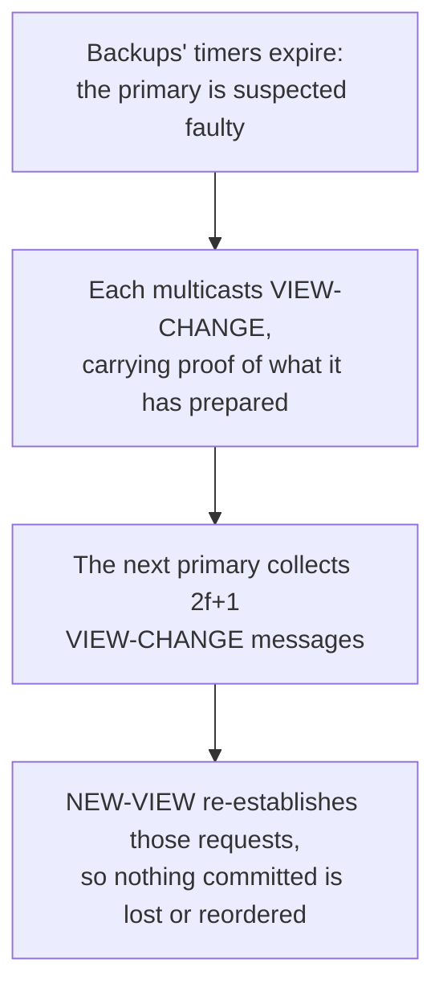

# 5. When the primary lies: view changes

## The primary is efficient and dangerous

The three-phase protocol has a soft spot, and it is the primary. Funneling every request through one proposer is what makes PBFT efficient, the same bargain Paxos and Viewstamped Replication struck, but the primary is also the one replica with special power, and it might be the faulty one. The prepare phase already blocks the worst thing a lying primary could do: it cannot get two honest replicas to commit different orders, because the backups cross-check each other. What a faulty primary can still do is stall. It can refuse to propose at all, behaving like a crashed leader. It can propose for some requests and quietly drop others. Safety is intact, no honest replica commits the wrong thing, but progress dies, and a service that never makes progress is as useless as one that gives wrong answers.

So PBFT needs a way to fire the primary, and it borrows the shape directly from the crash-tolerant seminars: the view change. The replicas move through numbered views, and in each view a different replica is the primary, chosen by a simple rotation. When the current primary looks faulty, the honest replicas agree to advance to the next view and its new primary. Viewstamped Replication had this mechanism for a crashed primary; PBFT hardens it against one that lies.

## Suspect, vote, and lose nothing

The trigger is a timeout. A backup that has been waiting too long for a request to make progress stops trusting the primary and multicasts a view-change message for the next view. That message is not a bare vote; it carries evidence. It includes proof of every request the backup has prepared since the last checkpoint, each proof being the pre-prepare plus 2f matching prepares, along with a checkpoint certified by 2f+1 replicas. The new primary waits until it has collected 2f+1 of these view-change messages, and then announces the new view with a set of re-established pre-prepares that reflect everything any honest replica had prepared.

This is where the commit phase from the last chapter earns its keep. Because a committed request was prepared at a quorum of 2f+1 replicas, and because the 2f+1 view-change messages the new primary gathers must overlap that quorum in at least one honest replica, the proof of that request is guaranteed to appear in the view-change evidence. The new primary cannot help but see it, and it carries the request forward into the new view at the same sequence number. Nothing that committed is lost, and nothing is reordered. A view change replaces the leadership without disturbing the agreed past.

## Safety always, liveness only sometimes

Notice what the view change protects and what it does not. It protects liveness, the ability to keep making progress by getting rid of a primary that has stopped doing its job. It does not protect safety, because safety never depended on the primary in the first place; the quorum math and the three phases guarantee that honest replicas agree on committed requests no matter how many primaries come and go. That division is the same one Paxos drew, and it is worth being exact, because it is the trap this seminar must not fall into. PBFT does not beat the FLP impossibility. The paper says so plainly: the algorithm "does not rely on synchrony to provide safety. Therefore, it must rely on synchrony to provide liveness; otherwise it could be used to implement consensus in an asynchronous system, which is not possible."

In practice that means the timeouts have to eventually be right. PBFT assumes only weak synchrony, that message delays do not grow without bound forever, and under that assumption a faulty primary is eventually suspected, replaced, and progress resumes. If the network misbehaves indefinitely, view changes can cycle and nothing commits, but nothing wrong commits either. PBFT doubles its timeouts as it changes views so that it cannot be trapped forever by transient delays, and once the network settles, an honest primary is found and the service moves again. Safety is a theorem that holds through any chaos; liveness is a promise that pays off once the network calms down. That is precisely the settlement the consensus seminar reached, now carried into the Byzantine world.

> **Principle:** A single proposer is efficient and therefore dangerous, so make replacing it cheap and prove that replacement loses nothing already decided. Safety must never rest on the proposer being honest. Only progress may, and only until the network lets you find an honest one.
