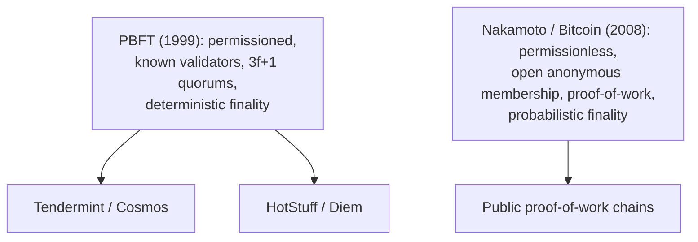

# 7. The blockchain lineage

## Two families, often confused

Say "Byzantine fault tolerance" today and most people think blockchain, and they are not wrong, but they usually blur two different families into one. PBFT is genuinely the ancestor of a large part of modern distributed-ledger consensus. It is not the ancestor of Bitcoin. Keeping those two lineages apart is the point of this chapter, because they answer different questions, and the difference is the membership assumption PBFT made in the sixth chapter: known participants with cryptographic identities.

## The PBFT lineage: permissioned BFT

The direct descendants keep PBFT's assumptions and refine its mechanics. Tendermint, the engine under the Cosmos ecosystem, is recognizably PBFT's child: a known set of validators, a rotating proposer, and a two-round voting scheme that commits blocks with deterministic finality, meaning once a block is committed it is final and will never be reverted. HotStuff, from 2019, is the same family made cleaner. It streamlines the view change that this seminar spent a chapter on, so that changing leaders costs a single linear round rather than the heavier all-to-all exchange, and it pipelines the phases for throughput. HotStuff became the basis of the consensus in Diem, the Facebook-initiated payment network, and its lineage runs straight back through PBFT to the Byzantine Generals. One of its authors, Michael Reiter, built Rampart, the mid-1990s Byzantine system that PBFT outran.

What every member of this family shares is PBFT's founding assumptions. The validator set is known and fixed, or changes only through an explicit reconfiguration. Each validator has a cryptographic identity the others recognize. Agreement uses quorums sized by the 3f+1 math, and finality is deterministic. These systems scale to tens or hundreds of validators, sometimes a few thousand, but not to an open anonymous crowd, because the all-to-all message pattern grows with the square of the membership and because you cannot count a set you do not know.

## The Nakamoto lineage: a different question

Bitcoin, from Satoshi Nakamoto's 2008 paper, answers a question PBFT never asked: how do you reach agreement among an open, permissionless, anonymous population, where anyone can join or leave at will and no one knows how many participants there are? In that world the 3f+1 math is not just hard, it is meaningless, because you cannot bound f when you cannot count n, and identities are free to forge, so a single adversary can spin up millions of fake participants. That is the Sybil attack, and Nakamoto consensus defeats it not with cryptographic identity but with cost: proof-of-work makes influence proportional to computation spent, so faking a majority means out-computing the honest world. The price is that finality is only probabilistic. A block deep in the chain is very unlikely to be reversed, but it is never certain, only exponentially improbable. There is no view change, no quorum of 2f+1, no committed-means-final.

These are two different tools for two different worlds, and the fork between them is the membership model. Closed membership with possibly-malicious members leads to the PBFT lineage: known validators, quorum votes, deterministic finality. Open membership with anonymous members leads to the Nakamoto lineage: proof-of-work or proof-of-stake, probabilistic finality, Sybil resistance by cost. Modern systems sometimes combine them, and Ethereum's move to proof-of-stake bolts a BFT-style finality mechanism onto an open-membership chain, which is a real convergence, but it is a deliberate composition of the two ideas, not evidence that they were ever the same. Blur PBFT into Bitcoin and you lose the one distinction that explains why each looks the way it does.

> **Principle:** The failure model tells you how members can misbehave; the membership model tells you who the members are. Together they are the first architectural decision. PBFT answers "known participants, some of them malicious," and Nakamoto answers "anyone at all, mostly anonymous," and those are different questions with permanently different shapes.
