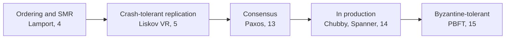

# 8. The finale: trust, and the end of the book

## The argument in one breath

Practical Byzantine Fault Tolerance keeps a replicated service correct when up to f of its 3f+1 replicas are not merely down but Byzantine: buggy, corrupted, compromised, colluding, and free to lie differently to different peers. It needs 3f+1 replicas rather than the crash model's 2f+1, because a quorum overlap must contain an honest node and not just a live one. It runs a three-phase protocol, pre-prepare, prepare, commit, where the extra round over Paxos exists so the backups can cross-check a primary that might lie, and it replaces a primary that stalls through a view change that loses nothing already committed. It leans on cryptography so that no faulty node can forge an honest one's messages, and its central engineering trick, using cheap message authentication codes instead of signatures on the common path, is what let it run a real file system at three percent overhead. Safety holds always; liveness holds under weak synchrony, exactly as in Paxos, because FLP still binds.

## The threads this book has been weaving

This is the last seminar, and it closes two threads at once.

The first thread is replication. Lamport's earliest seminar gave us ordering and the state-machine approach; Liskov's Viewstamped Replication and Lamport's Paxos made a replicated state machine survive crashes; the Google seminar put that machinery into planet-scale production; and PBFT now makes it survive treachery. Read left to right, the arc is a steady weakening of what you are allowed to assume about a node, from "it participates correctly" to "it may crash" to "it may lie," and each weakening costs more replicas, more rounds, and more machinery. The second thread is trust. Saltzer and Schroeder told us to mediate completely and grant least privilege, to verify rather than assume. Clark watched the internet lose trust in its own endpoints and warned that once you cannot trust the participants, the architecture must change. PBFT is where that idea reaches its limit: it assumes the participants themselves are adversarial and gets them to agree anyway.

There is a pleasing symmetry in who bookends it. Barbara Liskov opened the replication thread with Viewstamped Replication and closes it here with PBFT, crash tolerance and Byzantine tolerance from the same author a decade apart. Leslie Lamport named the Byzantine Generals problem in 1982, gave the field logical clocks and Paxos, and is the origin nearly every chapter of this thread traces back to. The people recur because the ideas do.

## Questions worth arguing about

1. **Do you actually face Byzantine faults?** Inside one trusted datacenter run by one team, crash tolerance is usually the honest model, and paying 3f+1 plus cryptography for a threat you do not face is waste. What in your system actually crosses the line, multiple mutually distrusting organizations, untrusted operators, money with final settlement, and what is just inside your own walls?
2. **Where is the honest witness in your quorums?** Anywhere you depend on a quorum, a config store, a ledger, a leader election, ask whether its overlap is guaranteed to contain a node that is not just alive but truthful, and what fault model you silently assumed when you decided it was safe.
3. **Where could a component equivocate?** Find the places in your system where one part could tell two other parts two different things, a split-brain primary, a poisoned cache, a compromised service, and ask what breaks. Equivocation is the fault PBFT was built to survive and the one most designs never consider.
4. **Which do you sacrifice under partition, safety or liveness?** Every consensus system in this book keeps safety and gives up progress when the network misbehaves. For your most critical agreement, is that the choice you want, and is it the choice you would actually get?
5. **Permissioned or permissionless?** If you use a ledger, know which lineage it is, and check that its finality model matches your assumptions. Treating a probabilistically-final confirmation as if it were deterministically final is a category error that has cost people real money.
6. **Have you written the failure model down?** For your most important system, state it explicitly: crash, Byzantine, or something in between like crash-plus-occasional-corruption. Most designs never say, and the unstated assumption is where the outage is born.

## Further reading

- **Castro and Liskov, "Practical Byzantine Fault Tolerance" (1999), and Castro's thesis (2001).** The paper and its fuller treatment.
- **Lamport, Shostak, and Pease, "The Byzantine Generals Problem" (1982), and Pease, Shostak, and Lamport, "Reaching Agreement in the Presence of Faults" (1980).** The origin of the problem and the 3f+1 bound.
- **Fischer, Lynch, and Paterson, "Impossibility of Distributed Consensus" (1985).** The limit PBFT respects rather than beats.
- **Oki and Liskov, "Viewstamped Replication" (1988).** The crash-tolerant sibling, and the fifth seminar.
- **Yin and colleagues, "HotStuff" (2019), and the Tendermint documentation.** The modern permissioned-BFT descendants.
- **Nakamoto, "Bitcoin" (2008).** The other lineage, for contrast.

## The end of the book

Fifteen seminars, one claim: the classics still explain the systems we build. The failure model, the quorum that must intersect, the replicated log, the module that hides a decision, the argument about what belongs at the edges, the transaction that is all-or-nothing, these are not history. They are the load-bearing structure of the software running right now, and the papers that introduced them remain the clearest explanations of why that software behaves the way it does. This book set out to read them honestly, not as nostalgia and not as scripture, but as working engineering that happens to be decades old and still correct.

It ends on Byzantine fault tolerance because that is where the field's oldest hard question, how to agree when some of you cannot be trusted, meets its newest systems, the ledgers and planet-scale databases that now assume adversaries by default. The recurring test of this book has been whether an author would recognize their idea in its modern form. Liskov and Lamport would, and have; they watched Byzantine agreement travel from an army camped around a city to the settlement layer of digital money. The last principle is the one the whole book has been arguing.

> **Principle:** The hard assumptions come first. Whether nodes crash or lie, whether members are known or anonymous, whether you need safety or availability when the network splits, these are not details to be discovered late. They are the first decisions, they determine everything downstream, and the reason the classics endure is that they are where those decisions were first thought through clearly.
